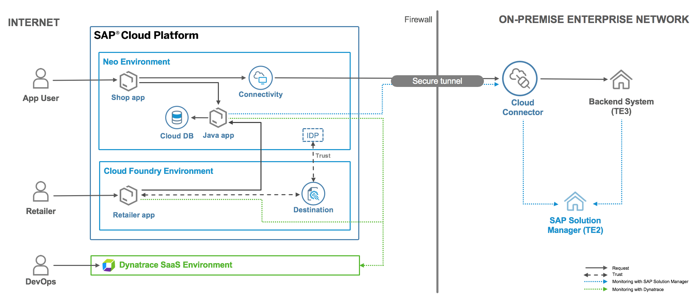

# Important Notice
This public repository is read-only and no longer maintained.

## Description
This guide has been created for the SAP TechEd 2018 session [OPP362](https://sessioncatalog.sapevents.com/go/agendabuilder.sessions/?l=191&sid=62559_481320&locale=en_US).
Monitoring cloud native applications or solutions running in a hybrid landscape is becoming more and more complex without the right tools. In this session, you will learn how to use the basic monitoring features of the SAP Cloud Platform, how to do end-to-end tracing with the SAP Solution Manager or how to trace each call and spot each bottleneck immediately with Dynatrace.
  

## Used landscape and systems
The different systems and their relation we use for our scenario are sketched out by the following landscape diagram.  
      

The used landscape consists of the following systems:
* On-premise backendsystem hosting the ICF service to be consumed in the cloud application. The backend with system name TE3 is based on SAP NetWeaver 7.52 and runs in the cloud.
* On-premise Cloud Connector to enable access to the backend. A productive version of the Cloud Connector (v.2.11.1) is running on your student notebook.
* SAP Cloud Platform subaccount to create, run and operate the cloud application. A new trial subaccount (Neo and Cloud Foundry environments) has been already created for each of the students. Everything has been already configured and deployed so that you can focus on the monitoring part.
* SAP Solution Manager to configure and run an end-to-end trace analysis. A dedicated system (v.7.2.) has been installed in the cloud for each student.
* Dynatrace environment. For the Teched session, we will used a dedicated cluster but you can do exactly the same exercise with a trial environment.

Everything has been already configured for you so that you can focus on the monitoring topic.
Nethertheless, here is a summary of the requirements that re needed if you want to set up the same hybrid landscape later on your own:
- Configuration of on-premise S/4HANA system and activation of Fiori Reference Apps OData Services. See [SAP tutorial](https://www.sap.com/germany/developer/tutorials/cp-connectivity-configure-fiori-reference-apps.html) for more details.
- Installation of Cloud Connector. See [SAP tutorial](https://www.sap.com/germany/developer/tutorials/cp-connectivity-install-cloud-connector.html) for more details.
- Installation of SAP Solution Manager. See [SAP official documentation](https://support.sap.com/en/solution-manager.html) for more details.
- Installation of the NEO Console and configuration of the environment variables to facilitate its usage in the console. See [SAP official documentation](https://help.sap.com/viewer/65de2977205c403bbc107264b8eccf4b/Cloud/en-US/7f4a5cf6-8885-44e4-9efd-6493b62fc1ca.html) for more details.
- Creation of SAP Cloud Platform trial account. See [SAP tutorial](https://www.sap.com/germany/developer/tutorials/hcp-create-trial-account.html) for more details.
- Deployment of the SAP demo app ESPM application. See [Github repository](https://github.com/SAP/cloud-espm-v2) for more details.
- Adaptation of the ESPM application to deploy the retailer app to the Cloud Foundry environment and establish connectivity between Neo and Cloud Foundry environments. See [SAP tutorial](https://developers.sap.com/tutorials/cp-connectivity-principal-propagation-cf-neo.html) for more details.
- Creation of Dynatrace trial environment. See [Dynatrace website](https://www.dynatrace.com/trial/) for more details.
  

## Preparation (Mandatory)
To finalize the setup for the exercises, some mandatory steps are required before starting the exercises:
  1. Access the SAP Cloud Platform cockpit and restart the cloud HANA database.
  1.	Connect the Cloud Connector to your SAP Cloud Platform subaccount and add an access control.
  1.	Verify that the cloud application runs without any issue. 

Follow the instructions on the [preparation page](/preparation/README.md) to get all the details.
  

## Exercises
The actual exercises are grouped into three lessons
* Lesson A: Basic monitoring features of SAP Cloud Platform 
In this lesson, you will explore how to use the out-the-box basic monitoring features of the SAP Cloud Platform to monitor your Java applications running in the Neo environment. You will create availability checks, alerts notifications, JMX checks and used the monitoring REST API.
  * [Exercise A1 - Availability checks and alerting](/exercises/A1/README.md)
  * [Exercise A2 - Custom metrics](/exercises/A2/README.md)
  * [Exercise A3 - Monitoring API](/exercises/A3/README.md)
* Lesson B: Trace analysis using SAP Solution Manager 
In this lesson, you will learn step-by-step how to configure your dedicated SAP Solution Manager and your SAP Cloud Platform account to run a trace analysis of your hybrid application. You will define the technical systems and the cloud services, create a scenario, activate the statistics in the cloud and then start the tracing.
  * [Exercise B1 - Getting started](/exercises/B1/README.md)
  * [Exercise B2 - Configuration](/exercises/B2/README.md)
  * [Exercise B3 - End-to-end tracing](/exercises/B3/README.md)
* Lesson C: Application performance using Dynatrace 
In this lesson, you will learn how to use the third-party APM tool Dynatarce to monitor your application running on the SAP cloud Platform. You will connect your dedicated Dynatrace environment with your Neo and your Cloud Foundry subaccounts, you will configure alert notifications and experiment how to debug different application anomalies.
  * [Exercise C1 - Getting started](/exercises/C1/README.md)
  * [Exercise C2 - Configuration](/exercises/C2/README.md)
  * [Exercise C3 - Alerting](/exercises/C3/README.md)
  * [Exercise C4 - Root-cause analysis](/exercises/C4/README.md)
  

## Final hints before you start
* As the **3 lessons don’t depend on each other**, you can choose which lessons you want to learn. In 2 hours, you should be able to run 2 of them, 3 if you are really fast. So you can start with one or the other lesson. Only the preparation steps need to be done at the beginning.
* Lessons A and B can be done later on as the cloud systems (SAP Cloud Platform Account and Dynatrace environment) will be available for the next **2 weeks**.
* Multiple systems with **different users**: As you are working on different systems that use all different user / password combinations you need to be very careful where to use which user. Too many failed login attempts will lock the systems. Please remember the following rules:
    * The user Demo is always used for the SAP backend TE3 or SAP Solution Manager TE2 user
    * Users starting with p are always SAP Cloud Platform users.
    * The user Administrator is only used for the Cloud Connector.
    * The Dynatrace requires always an email address to login.
* Use the provided **Student Overview Paper** to verify credentials during the hands-on session.
* Explore the **Student File Share** to check the assets needed during the exercises. You will find a shortcut on the desktop of your notebook. All assets are in the folder called OPP362.
* Your Teched image will be automatically deleted **5 minutes** after the end of the session.

## Handy links
* [SAP Cloud Platform Trial](https://account.hanatrial.ondemand.com/cockpit#/home/trialhome)
* [Cloud Connector](https://localhost:8443)
* SAP official documentation:
  * [Neo console client commands](https://help.sap.com/viewer/65de2977205c403bbc107264b8eccf4b/Cloud/en-US/56e309f496cc446ba441d862db94cb18.html)
  * [Configuring and Executing End-to-End Trace Analysis](https://help.sap.com/viewer/65de2977205c403bbc107264b8eccf4b/Cloud/en-US/a1e3101e108a4ca7a2a8c62654534ef8.html)
  * [Agent Activation for dynatrace](https://help.sap.com/viewer/1078be95fa054ae4ba3021a670248da9/Cloud/en-US/157d85927bc84ae88e314f36ef2a89cc.html)
* [Dynatrace environment](https://tgo909.dynatrace-managed.com)
* [Dynatrace documentation](https://www.dynatrace.com/support/doc/)
  

## How to obtain support
If you need any support, have any question, or have found a bug, please report it as an issue in the repository.
  

## Known Issues
Currently there are no known issues.
  

## Contact
This content is currently maintained by [Matthieu Pelatan](mailto:matthieu.pelatan@sap.com).
  

## License
Copyright (c) 2018 SAP SE or an SAP affiliate company. All rights reserved. 
This project is licensed under the Apache Software License, v. 2 except as noted otherwise in the  [LICENSE](LICENSE.txt) file.
