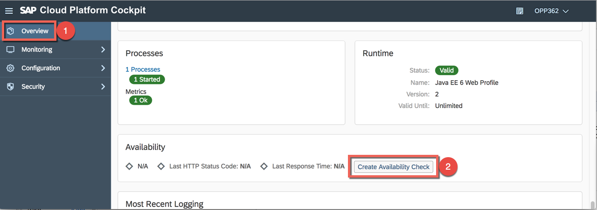

# Lesson A: Basic monitoring features of SAP Cloud Platform
# Exercise A1: Getting started

#### Objective
In this exercise, you will learn the basic monitoring features that SAP cloud Platform offers out-of-the-box. You will configure availability checks and alerting to be informed if the app is no more up and running or if predefined thresholds are reached.<br />
> Note: Be sure to go through the [preparation steps](../../preparation/README.md) before starting this exercise.

<br />

#### Estimated time
7 minutes
<br /><br />

## 1. Introduction to the monitoring service
The SAP Cloud Platform Monitoring service provides out-of-the-box features to monitor Java applications or database systems running on SAP Cloud Platform.<br /><br />
You can view current and historical metrics, register availability and JMX checks, and set alert recipients. Furthermore, you can integrate monitoring data with external tools or build new ones like dashboards, custom notifications or self-healing apps. You perform such operations by using the SAP Cloud Platform cockpit, the console client, the monitoring REST API or the alert webhooks.

> Note: The monitoring service is available in the Neo environment.

By navigating to the **Application monitoring** section of your application, you can see the following metrics:
  * Average response time
  * Busy threads
  * CPU load
  * Disk I/O
  * Heap memory usage
  * OS memory usage
  * Requests per minute
  * Used disc space

> Tipp: Click and drag horizontally or vertically to zoom in and shift-drag to scroll all charts simultaneously. Double-click to zoom out.<br /><br />
<br /><br />

Visit the [SAP official documentation](https://help.sap.com/viewer/64f7d2b06c6b40a9b3097860c5930641/Cloud/en-US/2dacf6f12dd047efad9bc8929ff1759d.html) to learn more about the service.<br /><br />


## 2. Create availability checks

1. Go back to the **Overview** section and scroll down to **Availability** and press the button **Create Availability Check**.<br /><br />
<br /><br />

1. Keep the standard thresholds and press the **Save** button.<br /><br />
<br /><br />

1. One minute later, you should be able to see the availability status and the response time of the application.<br /><br />
<br /><br />

## 3. Email notifications
Email notifications can be configure via the SAP Cloud Platform console client. The tool is part of the SAP Cloud Platform SDK for Neo environment. You can find it in the tools folder of your SDK location. The console has been already installed on your system and the environment variables have been updated so that everything is already prepared for you now. More details can be found in the [Official documentation](https://help.sap.com/viewer/65de2977205c403bbc107264b8eccf4b/Cloud/en-US/6dae74f3792446b7be65f5d8187c2425.html).

1. Open the terminal by clicking on the icon in the Windows menu.<br /><br />
      <br /><br />

1. Proxy settings
    ```
    set HTTP_PROXY_HOST=proxy
    set HTTP_PROXY_PORT=8080
    ```

1. Open Wordpad and prepare the following command:
    ```
    neo set-alert-recipients -a <YOUR-SUBACCOUNT-NAME> -u <YOUR-EMAIL-OR-USERNAME> -e <YOUR-RECIPIENT-EMAILS> -h <HOST>
    ```
    Here is an example with my P-USER:<br />

    ```
    neo set-alert-recipients -a p2000499901trial -b espmcloudweb -u p2000499901 -p Welcome18 -e opp362-001@mailinator.com -h hanatrial.ondemand.com
    ```
    > Note: If you don't want to put your own email address, you can use a service like [Mailinator](https://www.mailinator.com). Moreover be aware that the password attribute is optional in the command. If you don't add it, it will be asked by launching the script.

      <br />

1. Copy and launch the command in the console to create alert notifications.
    > Note: As it takes up to 5 minutes to be activated, let's continue with the next exercise and create custom metrics.

<br /><br /><br />

 [Next exercise](../A2/README.md) ｜ [Overview page](../../README.md)
