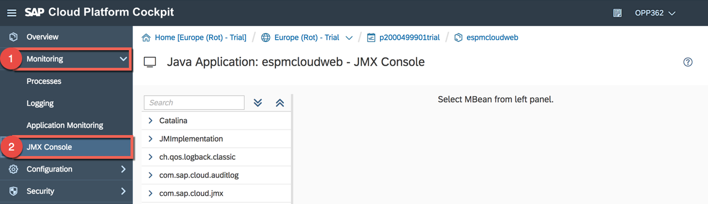
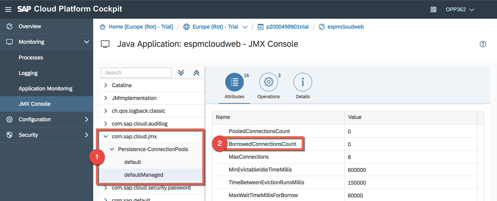
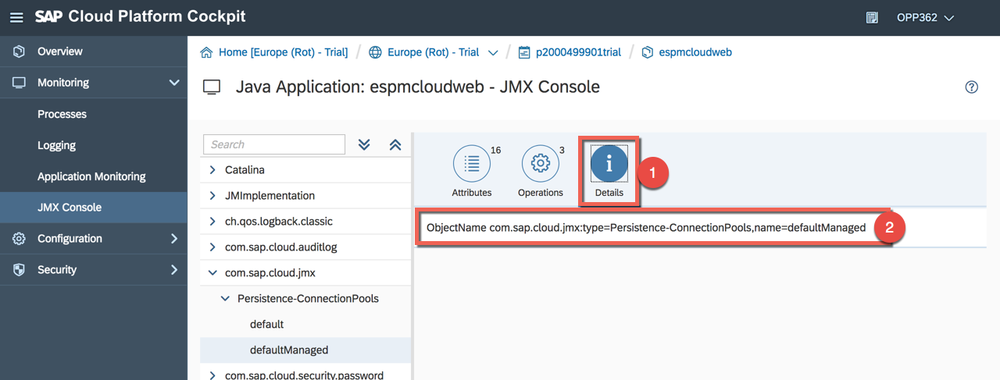
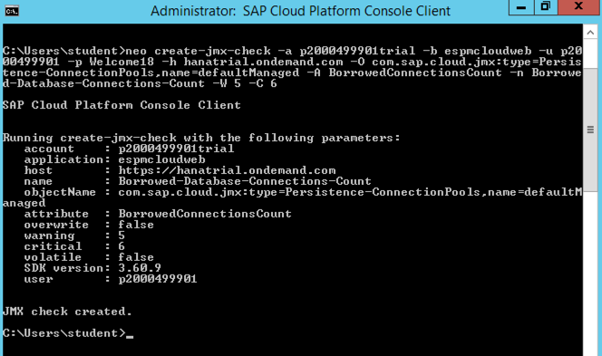
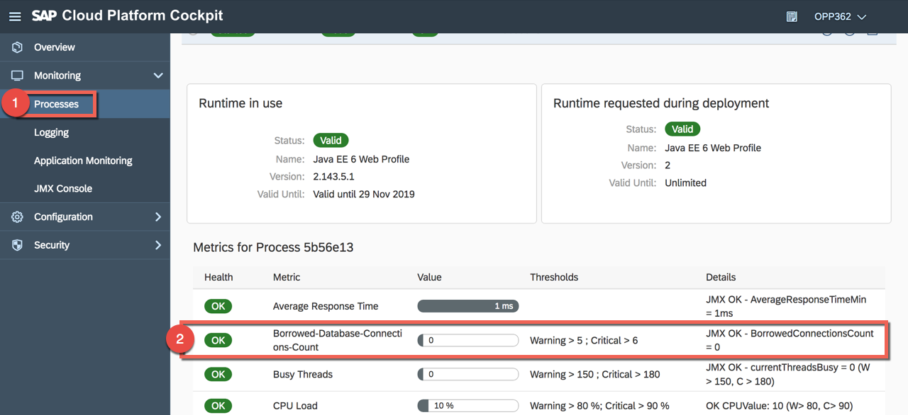

# Lesson A: Basic monitoring features of SAP Cloud Platform
# Exercise A2: Custom metrics

#### Objective
In this exercise, you will learn how to use the integrated JMX console and how to register JMX checks for your application. This will allow you to receive alert notifications based on a custom metric.
<br/><br/>

#### Estimated time
6 minutes
<br />
<br />

## 1. Get details in the JMX Console
1. In order to create a custom metric, we need the name of the attribute we want to observe. Navigate to **Monitoring** > **JMX Console**.<br /><br />
  <br /><br />

1. Expand the path **com.sap.cloud.jmx** > **Persistense-ConnectionPools** > **defaultManaged** and copy the name **BorrowedConnectionsCount** to Notepad.<br /><br />
  <br /><br />


1. Go now to the tab **Details** and copy **ObjectName com.sap.cloud.jmx:type=Persistence-ConnectionPools,name=defaultManaged** to Notepad.<br /><br />
  <br /><br />


## 2. Create a custom metric
1. Copy the following command to Notepad and rework it in Notepad by inserting your subaccount name (e.g. p2000499901trial) and your user name (e.g. p2000499901):
    ```
    neo create-jmx-check -a <YOUR-SUBACCOUNT-NAME> -b espmcloudweb -u <YOUR-SUBACCOUNT-USERNAME> -p Welcome18 -h hanatrial.ondemand.com -O com.sap.cloud.jmx:type=Persistence-ConnectionPools,name=defaultManaged -A BorrowedConnectionsCount -n Borrowed-Database-Connections-Count -W 5 -C 6
    ```

    > Note: The password is of course optional in the command. Read more in the [official documentation](https://help.sap.com/viewer/65de2977205c403bbc107264b8eccf4b/Cloud/en-US/298a207f33c4484b9894b7c4e2900566.html)
    <br />

1. Then go to the terminal and copy the adapted command and press **Enter**. You should see at the end **JMX check created**.<br /><br />
  <br /><br />

1. Go now to **Processes** under the **Monitoring** section and wait till the metric **Borrowed Database Connections Count** appears.<br /><br />
  

<br /><br />
<br /><br />

[ Previous exercise](../A1/README.md) ｜ [ Overview page](../../README.md) ｜ [ Next exercise](../A3/README.md)
