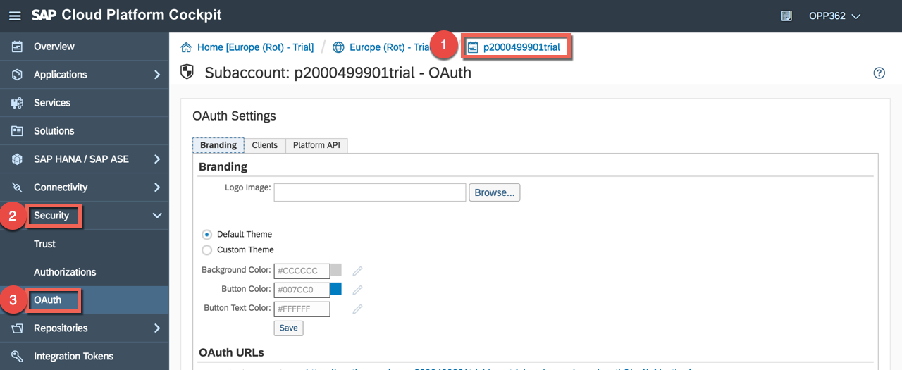
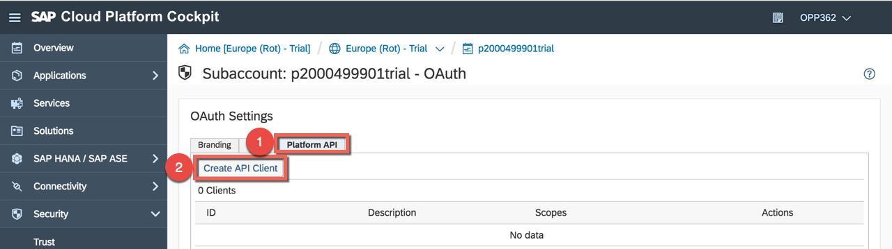
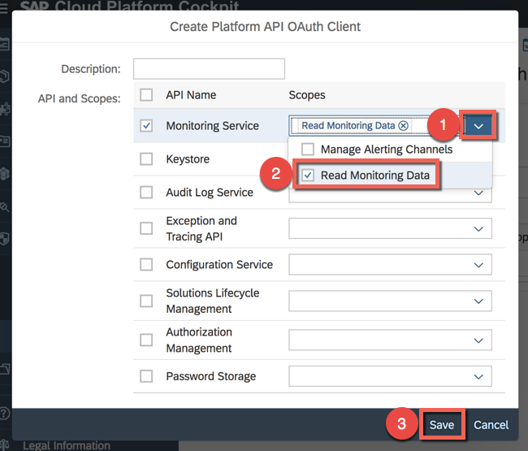
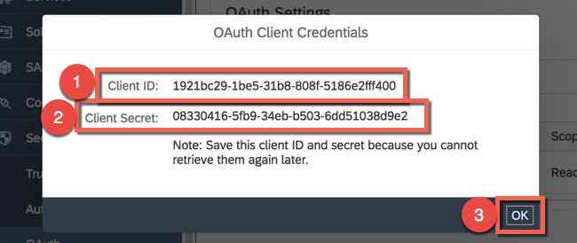
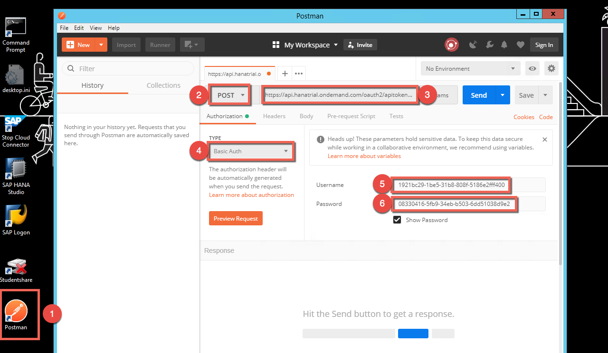
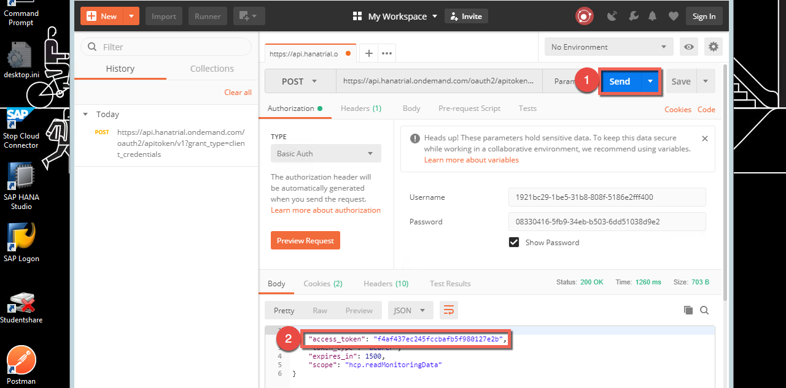
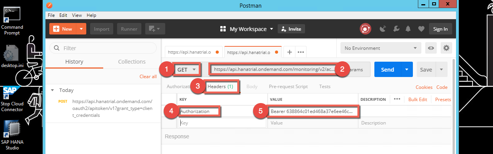
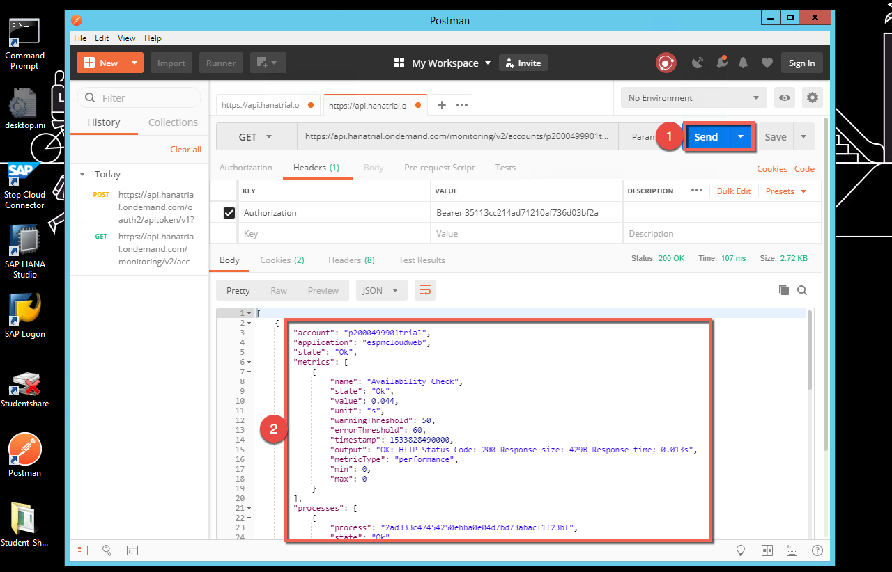

# Lesson A: Basic monitoring features of SAP Cloud Platform
# Exercise A3: Platform monitoring API

#### Objective
In this exercise, you will learn how to configure and consume monitoring REST API to get the state or the metrics details for your Java applications that are running on SAP Cloud Platform.  

#### Estimated time
10 minutes
  

## 1. Configure monitoring API

Platform APIs of SAP Cloud Platform are protected with OAuth 2.0 client credentials. So we need to create an OAuth client and obtain an OAuth API access token from the OAuth access token endpoint to call the platform API methods.  

1. To go back to the subaccount level, click on the subaccount name (e.g. **p2000499901trial**) in the breadcrumb. Then click on **OAuth** under the **Security** section.  
  

1. Go to the **Platform API** tab and press the button **Create API client**.  
  

1. Select **Read Monitoring Data** in the dropdown list of the **Monitoring Service** and click **Save**.  
  

1. Copy the **Client ID** and the **Client Secret** to Notepad as we will need them later on. Then click **OK**.  
  

## 2. Consume monitoring API
To test if we are indeed able to consume the API, we will use [Postman](https://www.getpostman.com/), which is an API development environment to verify functionality, reliability, performance, and security.
1. Click on the Postman shortcut on the Desktop to start the API development environment and add the following parameters to call the monitoring API:
    * Method: `POST`
    * URL:`https://api.hanatrial.ondemand.com/oauth2/apitoken/v1?grant_type=client_credentials` 
    * Authorization type: `Basic Auth`
    * Username: `<YOUR-CLIENT ID>` (e.g. 1921bc29-1be5-31b8-808f-5186e2fff400)
    * Password: `<YOUR-CLIENT SECRET>` (e.g. 08330416-5fb9-34eb-b503-6dd51038d9e2)  

    > Note: the start of Postman could take a minute as it should be first initialized.

  

1. Press the button **Send** to get your access token. Please copy it to Notepad.  
  

1. Open a new tab in Postman and add the following parameters:
    * Method: `GET`
    * URL: ` https://api.hanatrial.ondemand.com/monitoring/v2/accounts/<YOUR-SUBACCOUNT-NAME>/apps/espmcloudweb/metrics` (e.g. https://api.hanatrial.ondemand.com/monitoring/v2/accounts/p2000499901trial/apps/espmcloudweb/metrics)
    * Headers > KEY: `Authorization`
    * Headers > VALUE: `Bearer <YOUR-TOKEN>` (e.g. Bearer 638864c01ed468a37e6ee46c9121d6)  
  

1. Press the button **Send** to get the metrics from the monitoring API.  
  

> Note: read more API and how to use them in the [SAP official documentation](https://help.sap.com/viewer/65de2977205c403bbc107264b8eccf4b/Cloud/en-US/392af9d162694d6595499f1549978aa6.html). You can also find all the related destails in the [SAP API Business Hub](https://api.sap.com/api/HCP_Monitoring_v2/resource)

   

[ Previous exercise](../A2/README.md) ｜ [ Overview page](../../README.md) ｜ [ Next exercise](../B1/README.md)
