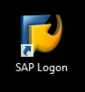
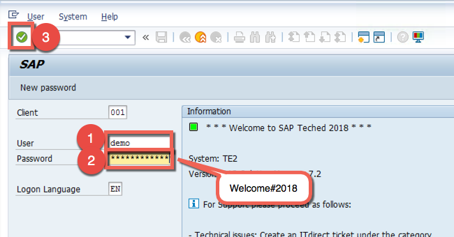

# Lesson B: Trace analysis using SAP Solution Manager
# Exercise B1: Getting started

#### Objective
In this exercise, you will get an overview of the different options provided by the SAP Solution Manager to monitor your applications running on the SAP Cloud Platform.  

#### Estimated time
5 minutes
 
 

## 1. Introduction to SAP Hybrid Supportability
SAP customers that are using SAP Solution Manager for their operations can leverage the hybrid supportability offerings.
Here are the main 4 capabilities that are relevant for monitoring applications running on the SAP Cloud Platform:
  * [Integration monitoring](https://help.sap.com/viewer/82f6dd44db4e4518aad4dfce00116fcf/7.2.05/en-US/5140d8bd-a295-4391-a3bf-d442bc2dcbe7.html): to ensure reliable data exchange between SAP on-premise and cloud.
  * [Trace analysis](https://help.sap.com/viewer/82f6dd44db4e4518aad4dfce00116fcf/7.2.05/en-US/24549de5-a335-4cef-9127-cff2d309852d.html): to trace performance of applications based on exposed statistics.
  * [User monitoring](https://help.sap.com/viewer/82f6dd44db4e4518aad4dfce00116fcf/7.2.05/en-US/ef80f08c-5e3a-4c29-903b-8338c66c0b38.html): to ensure availability and performance of SAP cloud scenarios from customer on-premise locations.
  * [Exception management](https://help.sap.com/viewer/82f6dd44db4e4518aad4dfce00116fcf/7.2.05/en-US/96847666-37fa-4e4f-a1a9-040d01b61469.html): to forward business-critical exceptions from SAP cloud to on-premise operations.

In the following exercises, we will focus on the trace analysis and show how to configure everything to analyse the hybrid application. At the end, we will be able to trace the request in order to get application performance data and insights about the request path.  

> Tipp: This [blog](https://blogs.sap.com/2018/02/02/brief-overview-of-hybrid-supportability-options-for-sap-cloud-platform/) gives a nice overview of the SAP Hybrid Supportability features.

  

## 2. Base setup
Just for your information, here is the list of what we did so far for you:
- Installed and configured of SAP Solution Manager
- Configured RZ70 - SLD Administration
- Provided user with following rights:
    * SAP_BI_E2E_RCA (SAP Solution Manager / E2E authorizations RCA)
    * SAP_SMWORK_CONFIG (Work Center: Solution Manager Configuration)
    * SAP_SMWORK_DIAG - (Work Center: Root Cause Analysis)
- Installed the SAP note [0002652988](https://launchpad.support.sap.com/#/notes/0002652988)

  

## 3. Login to SAP Solution Manager
1. Go to Desktop on click the **SAP Logon** icon.  
  

1. Open the **TE2 SAP Solution Manager** by double-clicking on it.  
  
  

1. Insert `Demo`as **User** name and `Welcome#2018`as Password and enter by pressing the green **Enter** icon.  

   

[ Previous exercise](../A3/README.md) ｜ [ Overview page](../../README.md) ｜ [ Next exercise](../B2/README.md)
