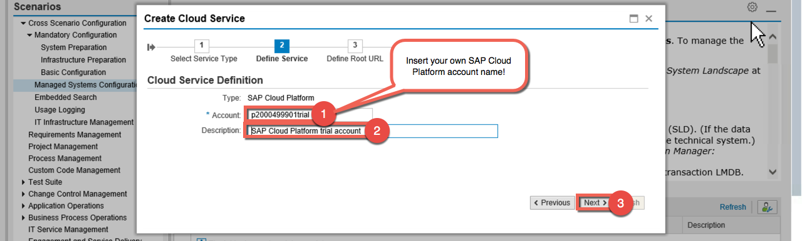

# Lesson B: Trace analysis using SAP Solution Manager
# Exercise B2: Configuration

#### Objective
In this exercise, you will learn how to configure the connection to your ABAP system and your SAP cloud Platform subaccount for retrieving the statistical data and enabling the end-to-end trace analysis.  

#### Estimated time
15 minutes
 
 

## 1. Technical systems configuration
1. Double-click the favorite **SAP Solution Manager Configuratons** (Transation SOLMAN_SETUP).  
  
  

1. A new window in your browser will open automatically. Close the first popup by clicking on the button **Continue**.  
  
  

1. Click on **Managed Systems Configuration** in the left menu. Then choose the ABAP backend system **TE3** and under **Configure System** click **Full Configuration**.
  
  
  

1. In the first step called **Assign Product**, press first the **Edit** button and click **Set Automatically**.  
  
  

1. Click now on the third step called **Maintain RFCs** and select the client **001**.  
  
  

1. Sroll down to the section **RFC - Standard Mode** and select the 3 check boxes.  
  
  

1. Scroll down to the section **Administration Users** and add the following credentials (same user for SAP Solution Manager TE2 and backend system TE2):
    * User: `SAP*`
    * Password: `Welcome18`  
      
  

1. Then Scroll up and press the button **Execute**.  
      

1. Confirm with **Yes** the upload of the roles to TE3.  
  
  

1. In the next popup, you will prompt to give the credentials of a superuser to upload the role. Enter the following details:
    * User: `SAP*`
    * Password: `Welcome18`   
  
  

1. Press the **Save** button and go to Step 5: **Enter System Parameters**.  
  
  

1. Go to **Common Parameters** and insert the following details:
    * Load Balancing Host: `wdflbmt7598.wdf.sap.corp`
    * Load Balancing Port: `8000` 
  and uncheck **Setup DBACockpit** in the **DB Parameters** section.  
    
    

1. Save and go to step 7 **Finalize configuration**.
  
  

1. Go to the section **Automatic Activities**. Then select **Execute** in the dropdown list of **Activate e2e trace upload** and press the button **Execute Selected**.  
  

## 2. Cloud services configuration

1. Before starting with configuration of the cloud service, let's add the SAP Cloud Platform certificate. Go to Chrome and open the URL `https://account.hanatrial.ondemand.com/` and logon. Then click on **Certificate** under **Secure**. (Be aware that the following procedure could be different if you use an other browser that Chrome).  
  

1. In the popup, go to the **Details** tab and press the button **Copy to file**.  
  

1. Click **Next** for the first 2 steps and that click on **Browse**. Select **Desktop** and name the file `sapcp.cer` and click **Save**.  
  

1. Click again **Next** and **Finish** to download the certificate.  
  

1. Click on the favorite **Trust Manager** (Transaction STRUST).  
  

1. Click the **Edit** icon and double-click on **SSL client SSL Client (Anonymous)** (Verify that you are on the right window ;). Then press the **Import** button.  
  

1. Select your file **sapcp.cer** (that should saved on your desktop) and press the **Enter** button.  
  

1. In the popup, click **Allow**.  
  

1. Add the certificate as part of the trusted list by clicking on the button **Add to Certificate List** an finally press **Save**.  
  

1. Go back to your browser tab with **Managed Systems Configuration** and press the button **Cloud Services**. If you closed the tab you can re-open it by ckicking again on the transaction favorite called **SAP Solution Manager Configurations** (Transaction SOLMAN_SETUP).  
  

1. Choose **Create Cloud Service** under **Cloud Services Operations**.  
  

1. In the wizard, select **SAP Cloud Platform** as service type and click **Next**.  
  

2. In the next step, give your SAP Cloud Platfform account name (e.g. p2000499901trial) and add a description for the cloud service.  
  

1. Finally insert the Rool URL `https://publicapingplog.hanatrial.ondemand.com` as we are on the trial landscape. Click **Next** and in the last step, press **Finish**.  
  

    [//]: # (
    Add the URLs for the other landscapes and maybe the documentation URL... 
          https://support.sap.com/en/solution-manager/sap-solution-manager-7-2/expert-portal/applications/hybrid-operations/public-cloud-operations/sap-cloud-platform.html 
          https://publicapingplog.hana.ondemand.com 
          https://publicapingplog.hanatrial.ondemand.com 
          https://publicapingplog.neo.ondemand.com 
          )
  

1. Now click on **Configure Cloud Service** to add the endpoint of the cloud service.  
  

1. In the new browser tab, press the button **Add** under the section **Cloud Service Endpoints**.  
  

1. Insert the following details in the popup window:
    * Description: `SAP CP HTTP Endpoint`
    * User: `<YOUR-SUBACCOUNT-USERNAME>`(e.g. p2000499901)
    * Password: `Welcome18`
    * Proxy Host: `proxy`
    * Proxy Port: `8080`  
    

1. Confirm the new endpoint by clicking on the **Save** button.  
  

1. Click on the **Check** button to verify the configuration of the endpoint was successful.
  

   

 [Previous exercise](../B1/README.md) ｜ [Next exercise](../B3/README.md) ｜ [Overview page](../../README.md)
