# Lesson B: Trace analysis using SAP Solution Manager
# Exercise B3: End-to-end tracing

#### Objective
In this exercise, you will learn how to create a scenario for your trace analysis, how to activate the statistics on the SAP cloud Platform side and how to execute the end-to-end trace.  

#### Estimated time
15 minutes
 
 

## 1. Creation of the scenario
1. In the **Scenarios** panel on the left side, please go to **Application Operations** > **Integration Monitoring** > **Interfaces and Connections** and click on the 4th step called **define scope**.  
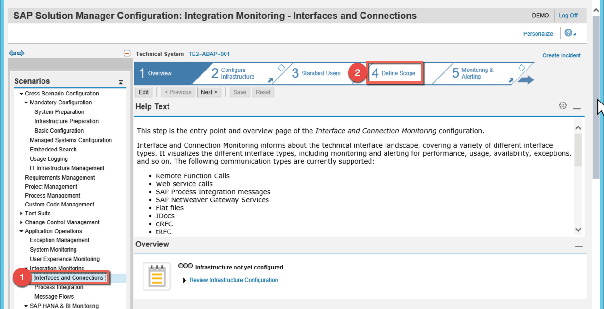  

1. Go to **Edit** mode and click the button **Create**.  
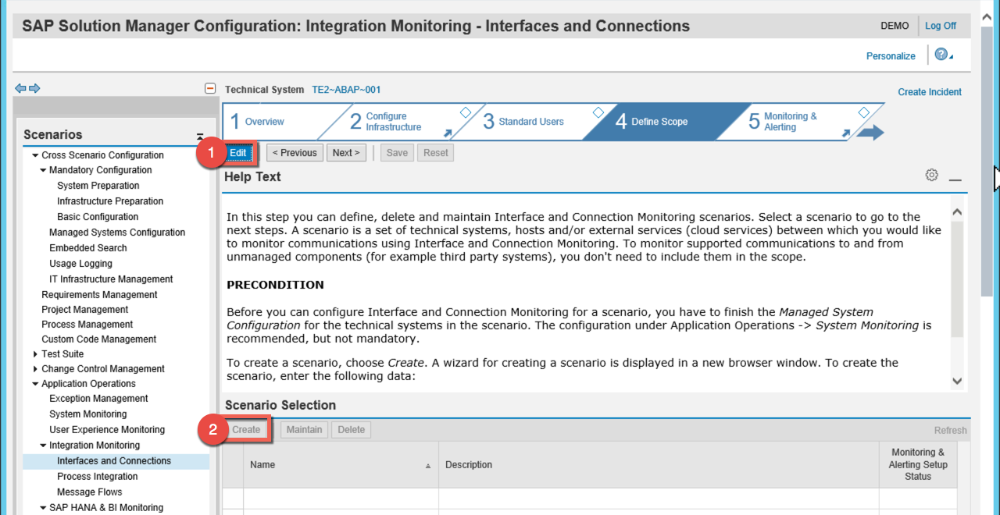  

1. In the first step of the wizard, you need to give a **name** without space nor special characters (e.g. `Scenario2018`) and a description like `Scenario for TechEd 2018`. Then click **Continue**.  
  

1. In step 2, add the technical Application Server ABAP system **TE3** and the SAP Cloud Platform account (**P20**), then press **Continue**.  
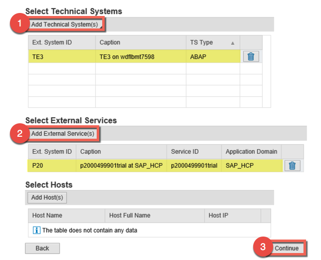  

1. Click **Save** to finalize the creation of the scenario.  
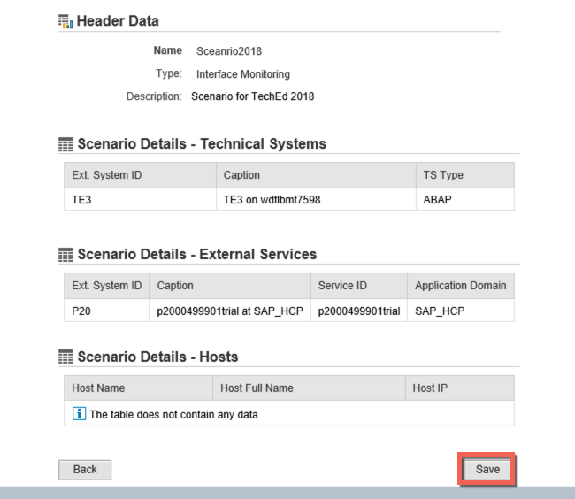  

### 2. Activation of statistics
The E2E tracing and collection of data is disabled by default for Java applications. It has to be activated on demand. Be sure to have the Developer role to enable it. More details can be found in the [official documentation](https://help.sap.com/viewer/65de2977205c403bbc107264b8eccf4b/Cloud/en-US/a1e3101e108a4ca7a2a8c62654534ef8.html).

1. In the SAP Cloud Platform cockpit, navigate to your Neo Java application called **espmcloudweb** and choose **Monitoring** > **JMX Console** > **com.sap.js** > **Statistics** > **Statistics** and verify that the status of the  **Switch** attribute is **false**.  
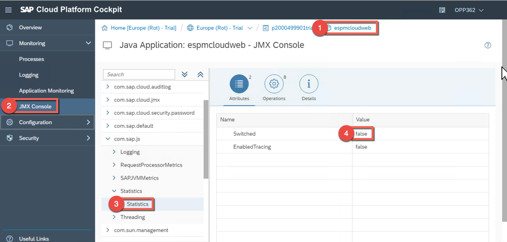  

1. Go to the **Operations** tab and enter `true` for the operation **doSwitch** in parameter **p1**. Then execute the operation by choosing the triangle icon.  
  

### 3. End-to-end trace analysis
1. Go back to the SAP Solution Manager and click the **Exit** icon to navigate to favorites.  
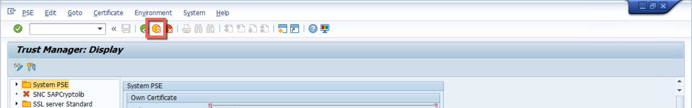  

1. Click the favorite **SAP Solution Manager: Work Centers** (Transaction SOLMAN_WORKCENTER).  
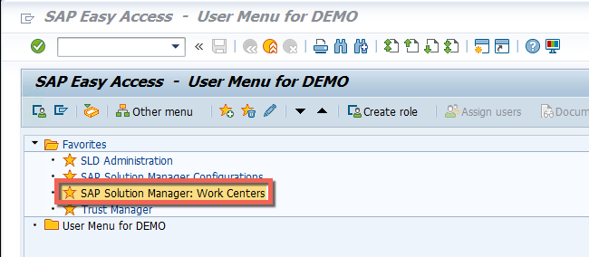  

1. Under **Root Cause Analysis** click on the tile called **End-to-End Traces**.  
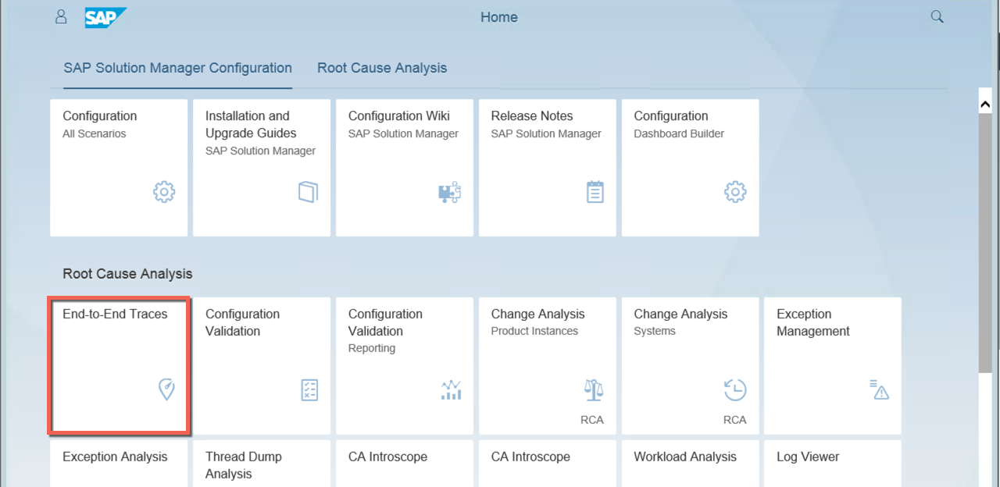  

1. Click on the **Scope selection** icon on the top right corner, Select the tab **Technical Scenarios** and press the **Go** button to see all scenarios. Then select **Scenario2018** and click **OK**.  
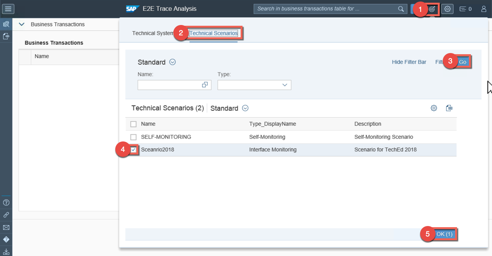  

1. Click on the **Trace Enabling** icon and enable the tracing for the backend system TE3 by pressing the **Toggle** button. The state should become green.  
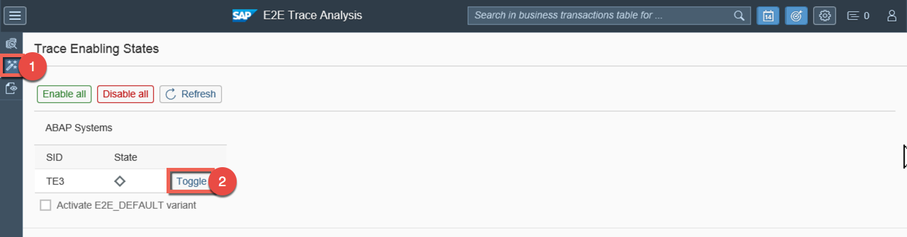  

1. Go back to the SAP Cloud Platform cockpit and open the application by clicking on the URL under the section **Overview**.  
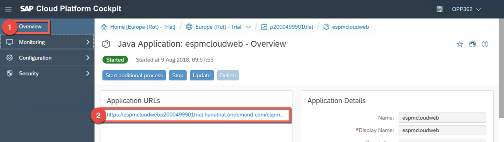  

1. Open the UI5 Diagnostics with **CTRL+ALT+SHIFT+S** and under **Technical information** scroll down to the end. Then change the trace level to **HIGH** and press the **Start** button.
    > Note: Do not close the UI5 Diagnostics window as we will need it later on.

       

      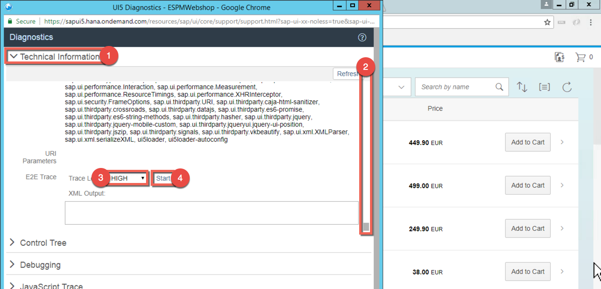  

1. Go back to the app and click on the first product to navigate to the product details page and wait for the prompt.  
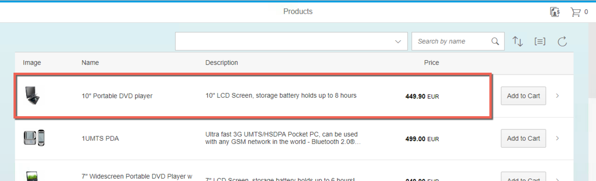  

1. After an instant a prompt will ask if you would like to record another transaction step. Click **Cancel**.  
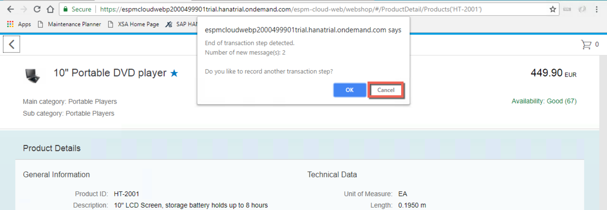  

1. In the next URL you can give the URL of the store server if you have configured the automation of the upload of the trace. In our case, we will do it manually, so click **Cancel**.  
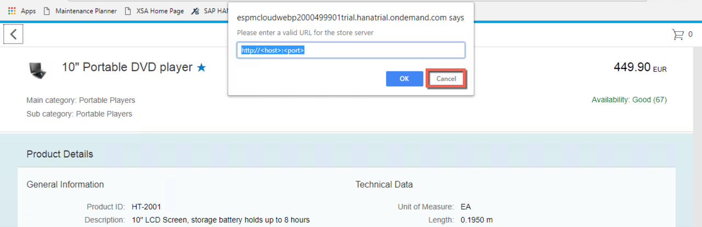  

1. Go back to the UI5 Diagnostics window and copy the XML Output.  
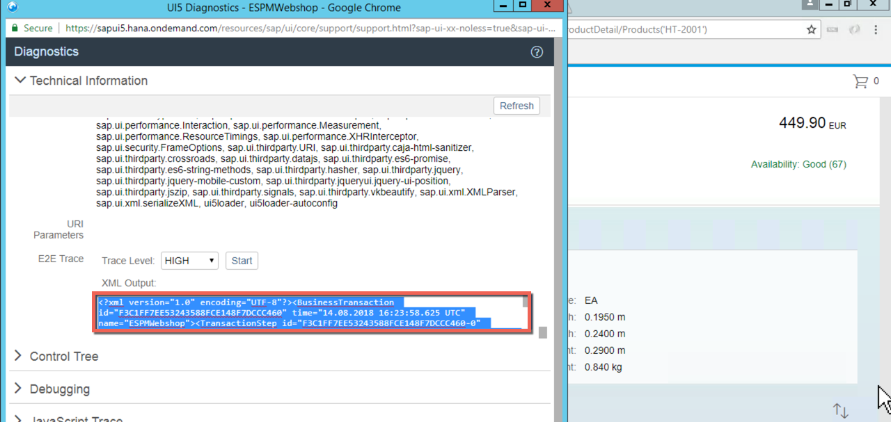  

1. Use Notepad to save the content in a file named **BusinessTransaction01.xml** (the file name needs to start with "BusinessTransaction"). By saving change file type to **All Files**.   
  

1. Go back to SAP Solution Manager and click the **Trace Analysis** icon and import the previously saved file. Finally press the **Upload** button.  
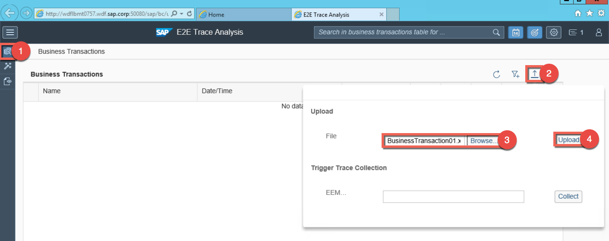  

1. Open the the dropdown list and select **Collect**.  
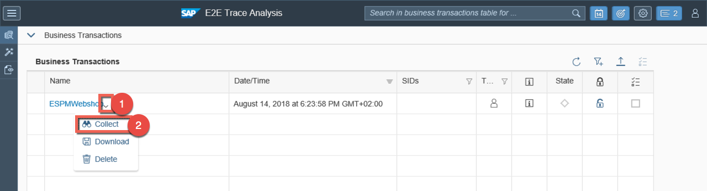  

1. After the collection, click on **Ok**.  
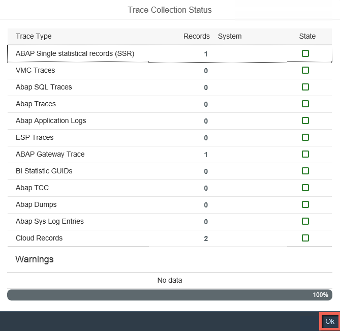  

1. Click on **ESPMWebshop** to see more details about the transaction.  
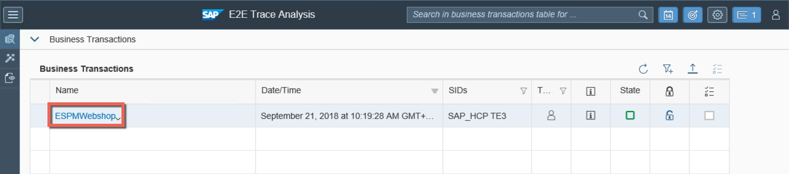  

1. Click on **Transaction Steps**.  
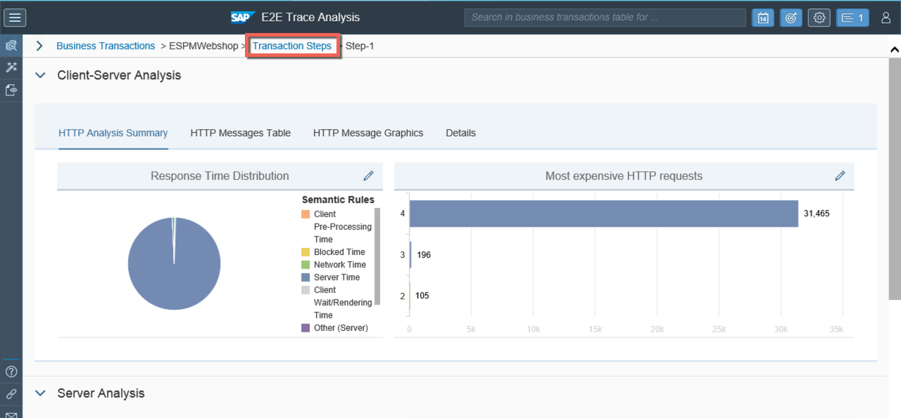  

1. Here you can see an overview of all uploaded business transactions and the recorded steps of the currently selected one. In our example we have recorded only one step but in case you want to recorded several steps, you would be able to easily navigate between them.

> Hint: to record several steps, you need to press the **OK** button instead of **Cancel** by recording with the UI5 Diagnostics tool.  
  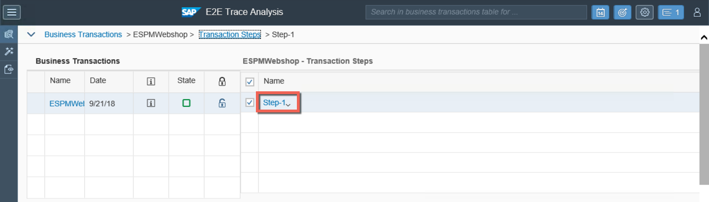  

1. Scroll down to the **Client-Server Analysis** section and click on the pie chart in response time distribution or the bars in most expensive HTTP requests, you would get additional information about which request is referenced.  
  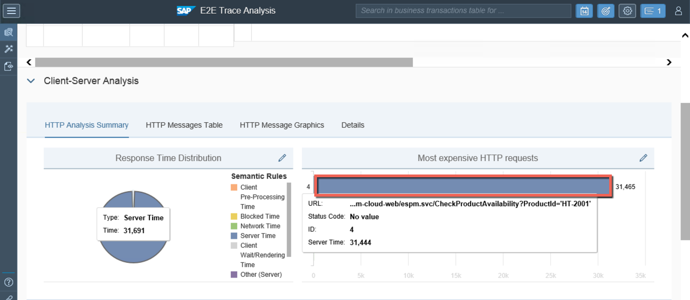  

1. Scroll down to the section **Server Analysis** and see the time spent for each system, so that you can get an idea where the problem is coming from.  
  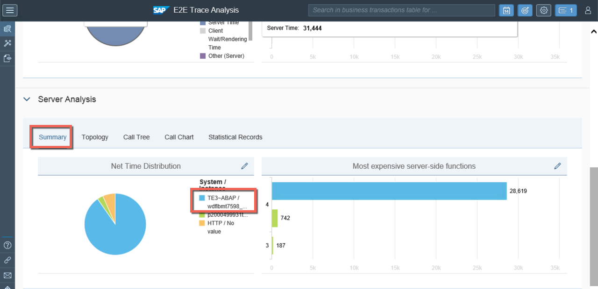  

1. In the **Topology** tab, you can see where the transaction went through and the time spent at each point.  
  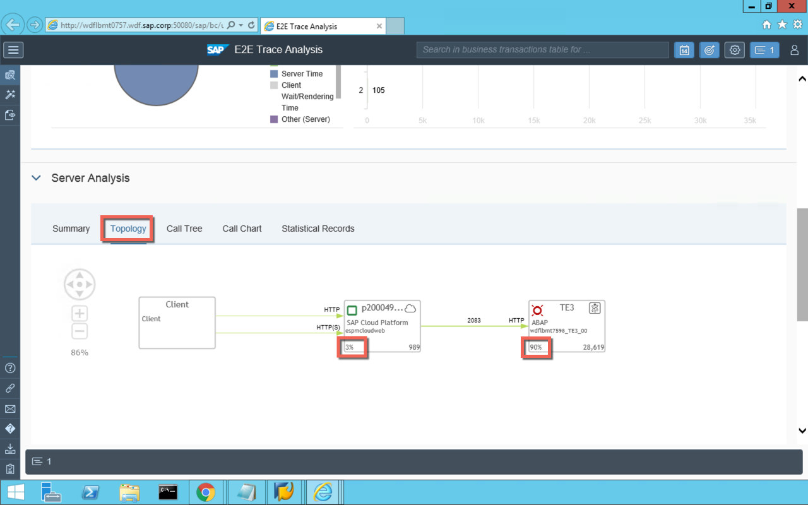  

1. In the tab **Call Tree**, you can expand down to see the exact requests and times.  
  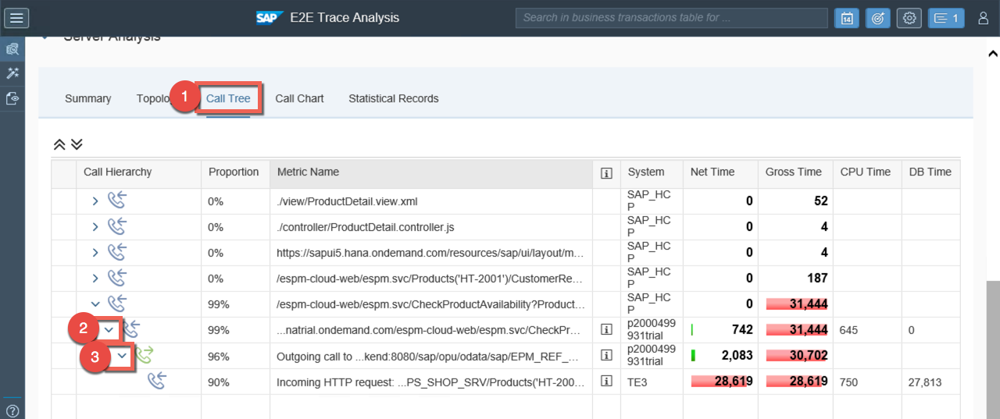  

1. Pressing the **i** icon on each call gives you additional details.  
  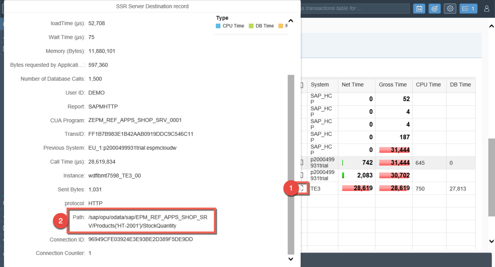

   

[ Previous exercise](../B2/README.md) ｜ [ Overview page](../../README.md) ｜ [ Next exercise](../C1/README.md)
