# Lesson C: Application performance using Dynatrace
# Exercise C2: Connect SAP Cloud Platform to Dynatrace

#### Objective
In this exercise, you will learn how to enable the Dyntrace Agent to monitor your cloud applications running in the Neo or in the Cloud Foundry environments of the SAP Cloud Platform.<br /><br />

#### Estimated time
10 minutes

## 1. Connect your NEO application to Dynatrace
1. Go the SAP Cloud Platform and search for **Agent Activation for Dynatrace** under the section **Services**.<br /><br />
    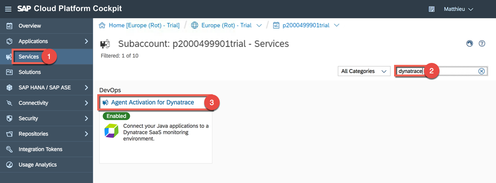<br /><br />
    > Note: The Agent Activation for Dynatrace is a new service that enables you to connect Java applications to your Dynatrace SaaS monitoring environment. By configuring the service, you allow the Dynatrace Agent to be injected into all your applications after their next restart. The agent then collects monitoring data - metrics, events, and end-to-end traces – and sends all the data to your monitoring environment running in datacenters that are hosted by Dynatrace. More details can be found in the [official documentation](https://help.sap.com/viewer/1078be95fa054ae4ba3021a670248da9/Cloud/en-US/157d85927bc84ae88e314f36ef2a89cc.html).

1. Go to **Configuration** and enter the following details under **Dynatrace Connection Details**. Then test the connection and press the button **Save**.
    * Environment URL: `https://tgo909.dynatrace-managed.com/e/<YOUR-ENVIRONMENT-ID>` (e.g. https://tgo909.dynatrace-managed.com/e/2c21afcc-6512-4da3-8b0e-28bad7bbd235/)<br />
      > Note: To find the Environment URL, log on to your Dynatrace SaaS monitoring environment, and copy its URL.
    * PaaS Token: `<YOUR-TOKEN>` (e.g. zf6qD7rIQmWZ-966lHPdo)<br />
      > Note: To find the PaaS Token, log on to your Dynatrace SaaS monitoring environment, and navigate to **Settings** > **Integration** > **Platform as a Service**.<br />

    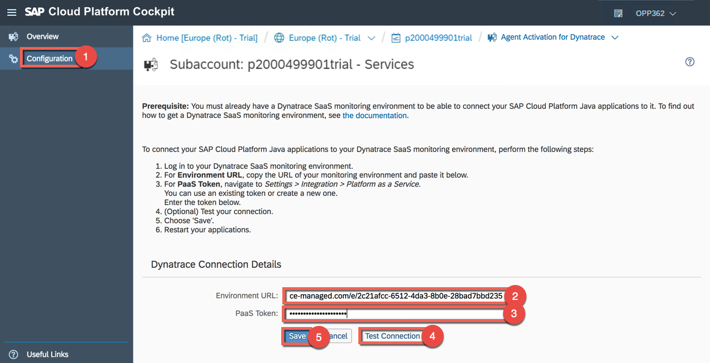<br /><br />

1. Go to the subaccount level by clicking in the breadcrumb and navigate to **Applications** > **Java Applications** and restart the **espmcloudweb** application.<br /><br />
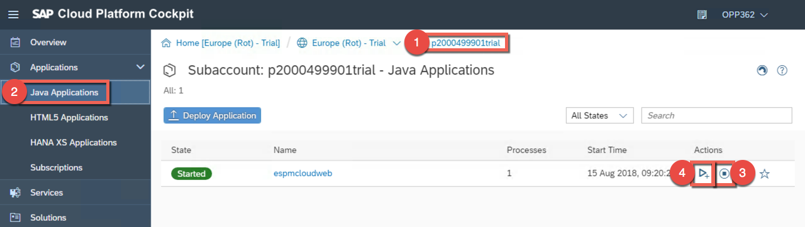<br /><br />

1. Let's open now the Neo application **espmcloudweb** and place an order so that Dynatrace can collect some data. To see the URL of the application.<br /><br />
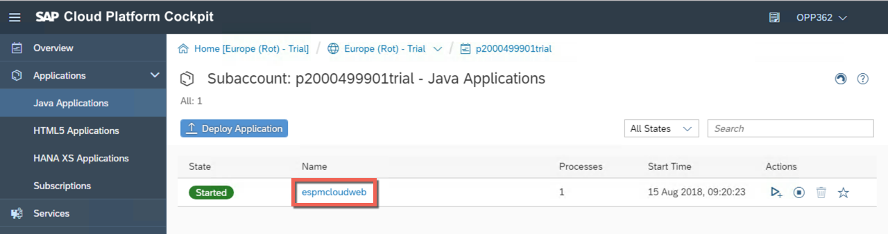<br /><br />
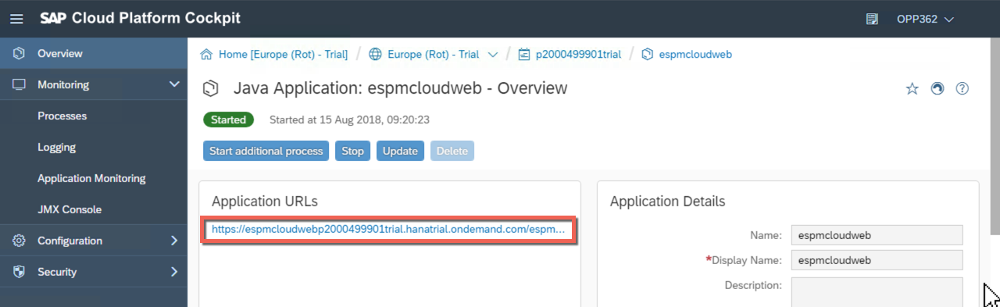<br /><br />

1. Add the first 2 products to the Cart and click the Cart icon.<br /><br />
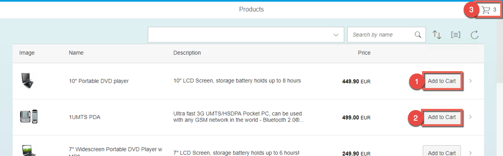<br /><br />

1. Press the button **Go to checkout**.<br /><br />
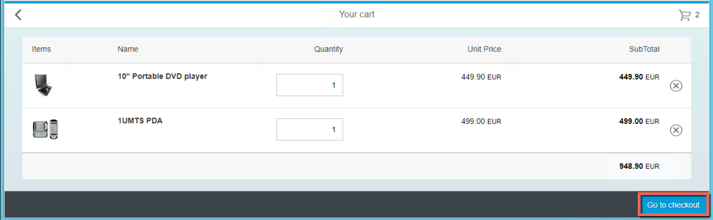<br /><br />

1. Press the button **Step 2**.<br /><br />
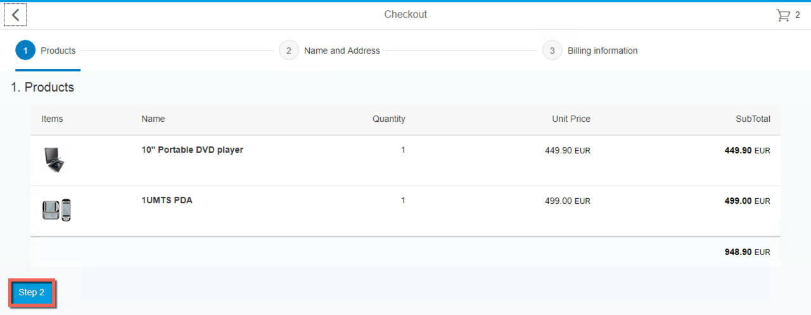<br /><br />

1. Insert `amelie.troyat@angere.fr` as Email and press **Enter** on your keyboard.<br /><br />
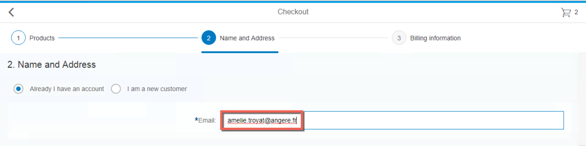<br /><br />

1. Press the button **Step 3**.<br /><br />
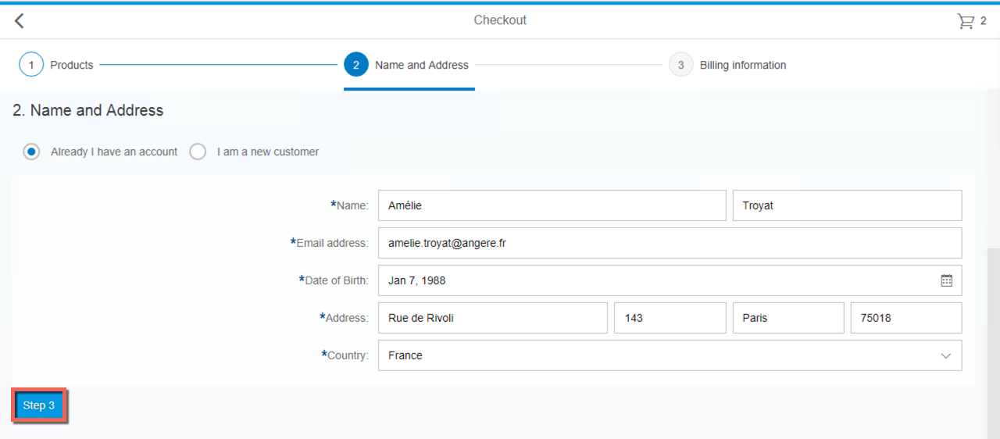<br /><br />

1. Insert the following details and press the button **Review**:
    * Card number: `123456789`
    * Security code: `1234`<br /><br />
  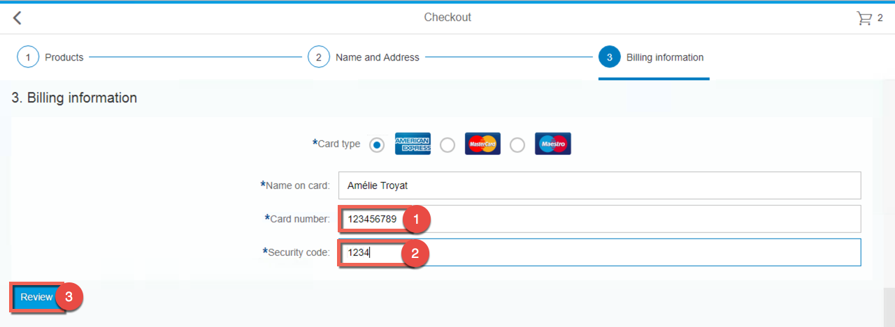<br /><br />

1. Finally press the button **Place an order**.<br /><br />
  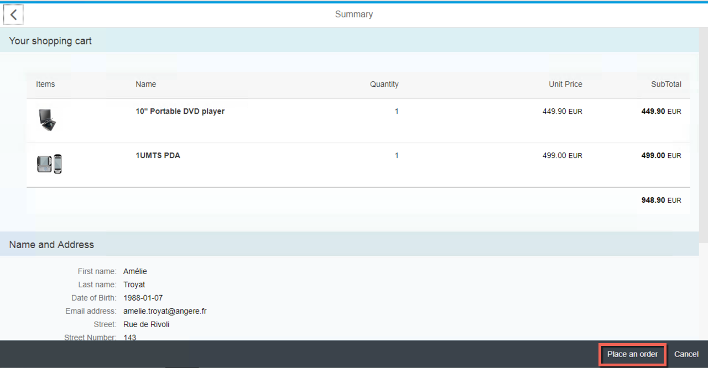<br /><br />

1. Go to your Dynatrace environment and verify that the Neo app is visible. Click on **Smartscape topology** and click around the different levels to see how Dynatrace is collecting the information: **Data centers**, **Hosts**, **Processes**, **Services** and **Applications**.<br /><br />
  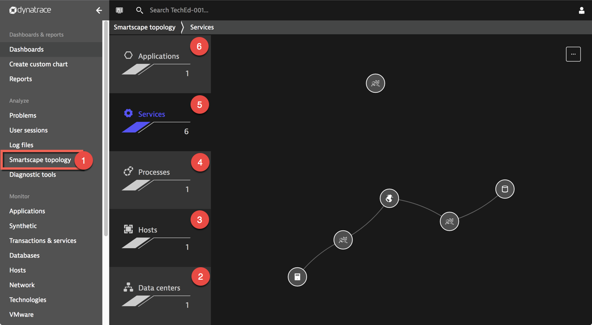<br /><br />

1. By default, the process name of the application is a combination of the SAP Cloud Platform subaccount name and the application name. If needed, this name can be changed to a meaningful name. To do so, go over the process and click the small enter icon on the right side.<br /><br />
    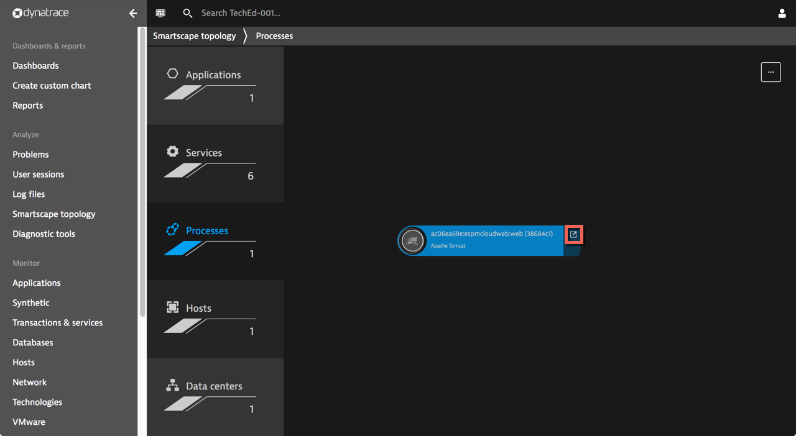<br /><br />

1. Click the button with  **...** and select **Edit**<br /><br />
    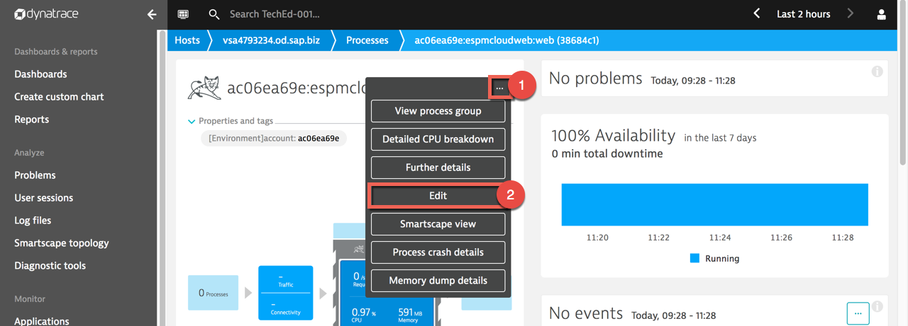<br /><br />

1. Enter a new name for the application process (e.g. webshop). The change is automatically saved.<br /><br />
      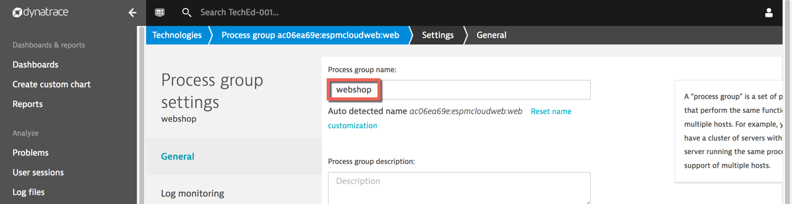<br /><br /><br />


## 2. Connect your CF application to Dynatrace
1. Let's now connect the Cloud Foundry app with Dynatrace. Go to the Cloud Foundry environment by clicking on **Home** in the breadcrumb.<br /><br />
  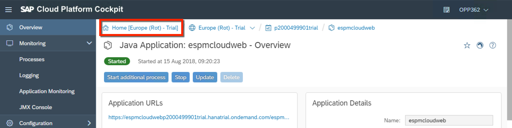<br /><br />

1. Click on the tile called **Cloud Foundry Trial**.<br /><br />
  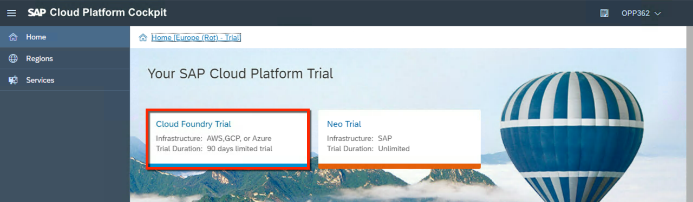<br /><br />

1. Click on your subaccount.<br /><br />
  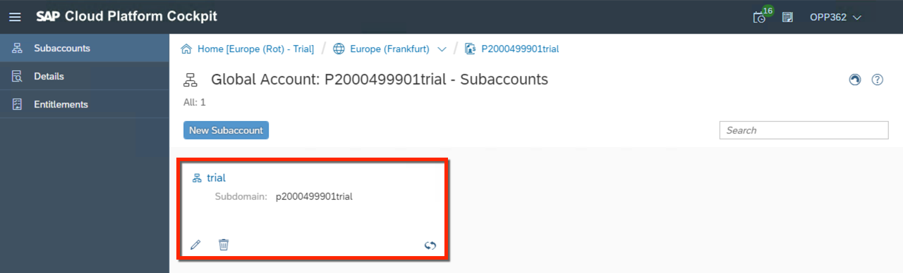<br /><br />

1. Select **Spaces** in the left navigation menu and click on your **dev** space.<br /><br />
  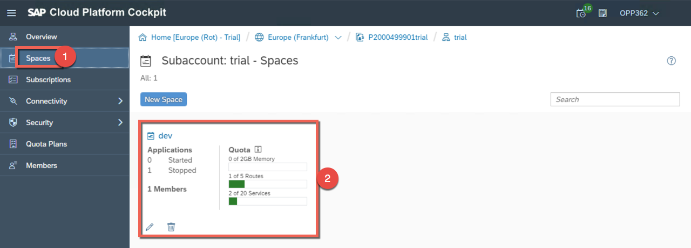<br /><br />

1. Under **Services** select **User Provided Services** and press the button **New Instance**.<br /><br />
  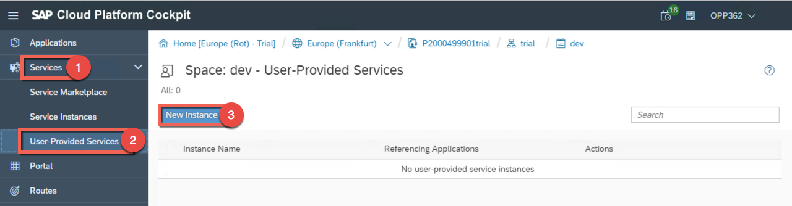<br /><br />
    > Note: Cloud Foundry allows you to connect applications with 3rd party tools and other external resources. On Cloud Foundry, service instances hold the credentials that are required to connect to such resources. You'll use this same approach to connect your apps with OneAgent. This is why you need to define a service instance by either creating a so-called "user-provided service".

1. Insert `dynatrace-service` as instance name (be aware that this name should contain `dynatrace` and add the following code in **Credentials**. Then click **Save**.
    ```
    {
      "environmentid": "<YOUR-ENVIRONMENT-ID>",
      "apitoken": "<YOUR-API-TOKEN>",
      "tag:SAP CP": "",
      "tag:Region": "Frankfurt",
      "apiurl": "https://tgo909.dynatrace-managed.com/e/<YOUR-ENVIRONMENT-ID>/api"
    }
    ```

      > Note: Don't forget to replace **YOUR_ENVIRONMENTID** with your Dynatrace environment ID (e.g. 2c21afcc-6512-4da3-8b0e-28bad7bbd235) and **Your YOUR_API_TOKEN** with the token that you have previously created (e.g. zf6qD7rIQmWZ-966lHPdo)<br />
      Be aware that the last attribute **apiurl** is only needed if you are using a dedicated Dynatrace cluster. It's not needed if you are using Dynatrace SaaS. More information can be found in the [Dynatrace documentation](https://www.dynatrace.com/support/help/cloud-platforms/cloud-foundry/application-only/deployment/deploy-oneagent-on-sap-cloud-platform-for-application-only-monitoring/).

      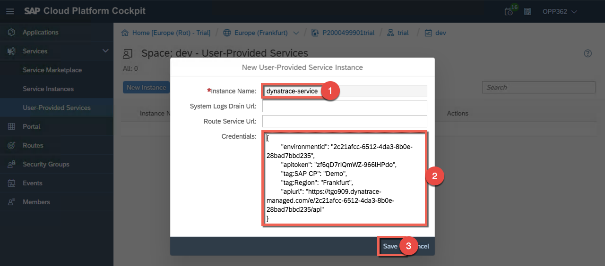<br /><br />

1. To bind the Dynatrace service to the application, you can either bind the created Dynatrace service to your application in your manifest.yml file prior to deploying/pushing your app or you can bind the service to your app in the SAP Cloud Platform cockpit and restage the application afterward via the Cloud foundry CLI. For the sake of time, we will just redeploy the application. Go to **Applications** and press the button **Deploy Application**.
    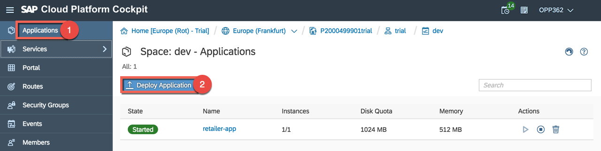<br /><br />
    > Note: If you have not called your service **dynatrace-service**, you will need to edit the manifest file of the app router.

    <br />

1. Import the file approuter.zip and its manifest from the student share in the folder Lesson_C and press the button **Deploy**.<br /><br />
    
    > Note: the start of the application may take up to 1 minute.
    <br />

1. After the deployment, you can verify under **Services** > **Service Instances** that the dynatrace instance is bound to the application.
<br /><br />
  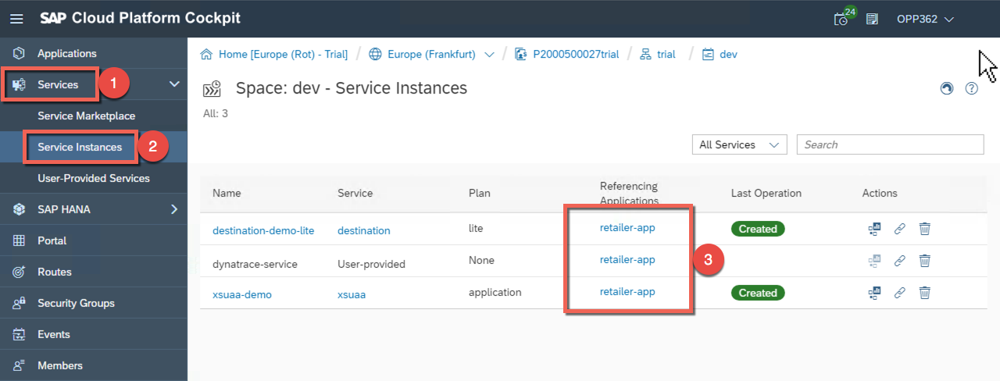<br /><br />

1. Go back to **Applications** and click on the application name **retailer-app**.<br /><br />
  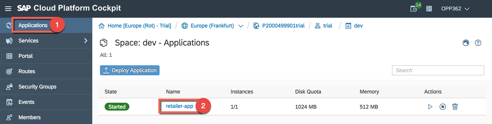<br /><br>

1. Click on the URL of the application to open it in the browser.<br /><br />
  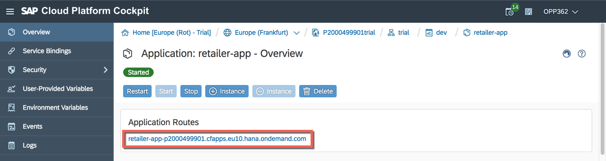<br /><br />

1. Insert credentials provided on your student overview paper:
    * Email: `OPP362-<YOUR-STUDENT-NUMBER>@teched.cloud.sap` (e.g. OPP362-001@teched.cloud.sap)
    * Password: `Welcome18`
  <br /><br />
  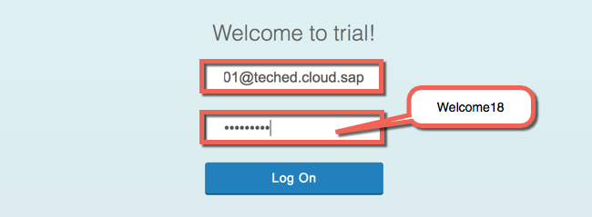<br /><br />

1. Click around the applicatiom so that Dynatrace can collects some data. You can for example verify that the previously placed order is visible.<br /><br />
    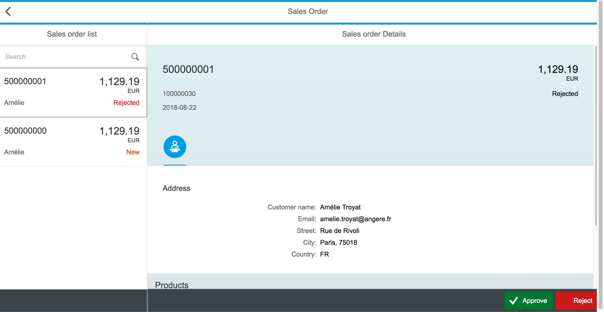<br />
    > Note: Please refresh your browser if you don't see any data in the UI at the beginning.
    <br />

1. Go now to your Dynatrace environment and verify that your application is now monitored. You can see for example in the **Dashboard** section. You should now see 2 hosts.<br /><br />
  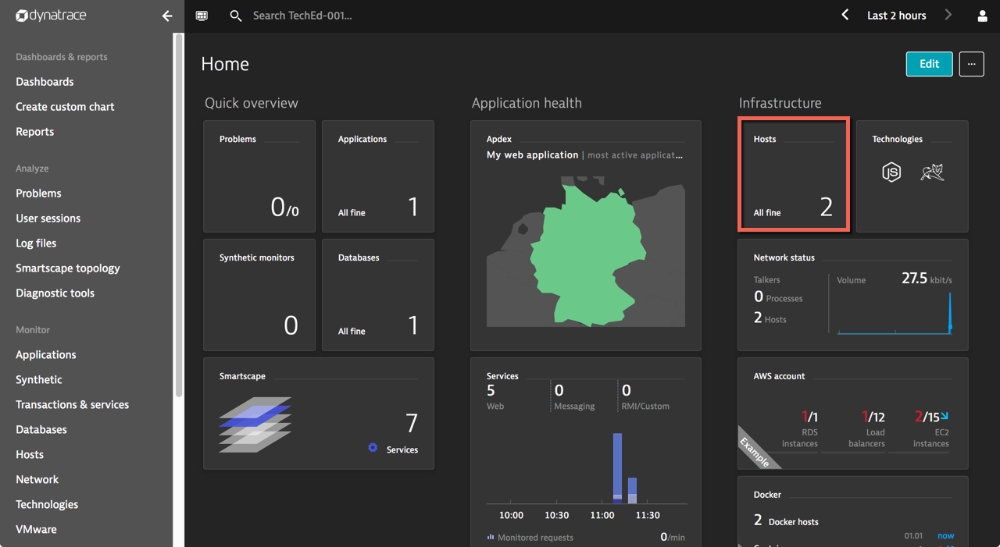
  <br /><br /><br />


[ Previous exercise](../C1/README.md) ｜ [ Overview page](../../README.md) ｜ [ Next exercise](../C3/README.md)
