# Lesson C: Application performance using Dynatrace
# Exercise C3: Alerting

#### Objective
In this exercise, you will learn how to define the preferred method to receive real-time notifications related to problems in your environment. Then you will configure detection sensitivity and set alert thresholds for infrastructure components or certain services.  

#### Estimated time
10 minutes
 
 

## 1. Notification configuration
1. First we need to configure the way alerts will be sent. From the dashboard, click on the tile called **Problem**.  
  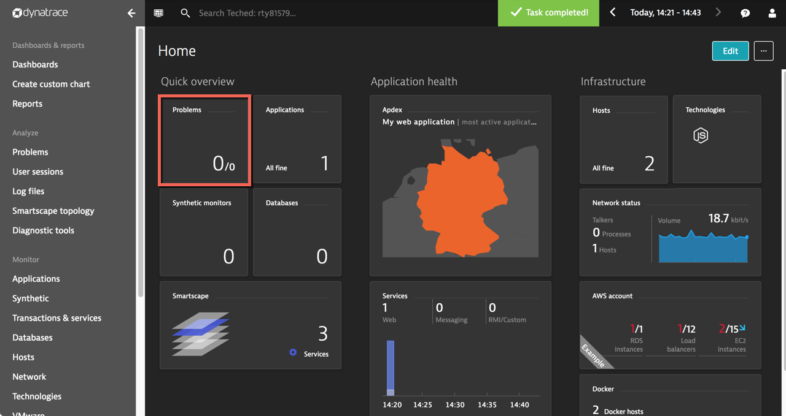  

1. Click on **Set up notifications** to jump directly to the right settings section.  
  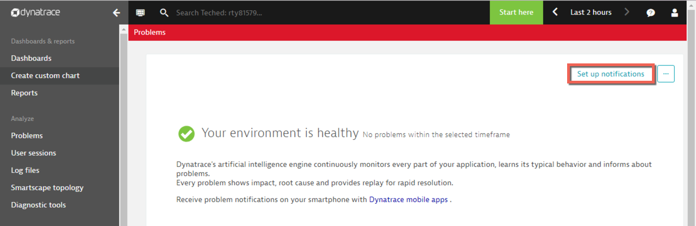  

1. Press the button **Set up notifications**.  
  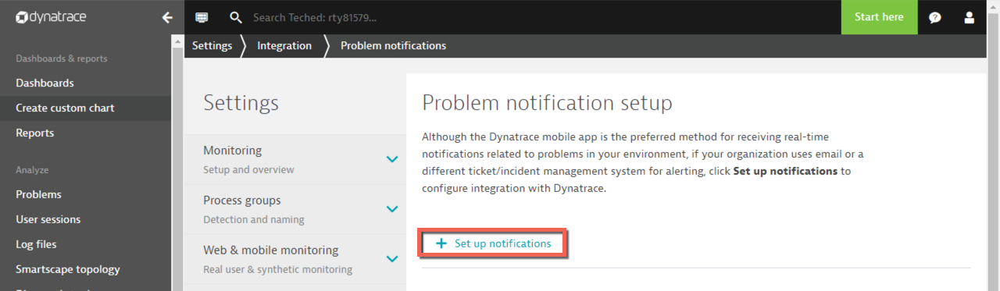  

1. Click on **Email** to get the alert sent to your email address.  
    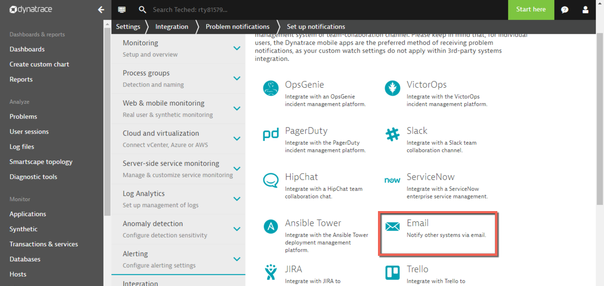  

1. Add a meaninful display name and an email address to get the notifications. If you don't want to put your own email address, you can use a service like [Mailinator](https://www.mailinator.com).  
    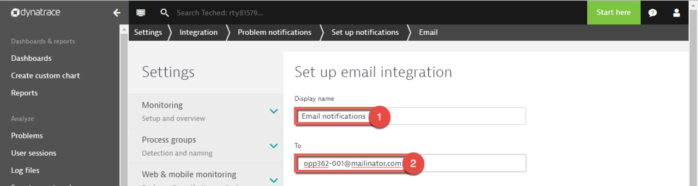  

1. Then scroll down and send a test notification before saving the configuration.  
    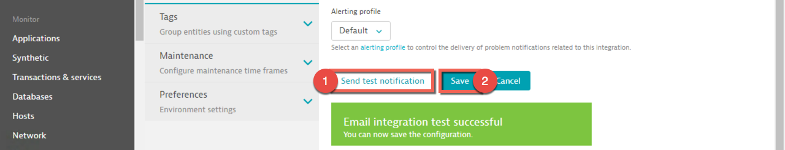  

## 2. Infrastructure alerts
1. Let us now refine the default configuration of the Dynatrace alerts for infrastructure. Expend the section **Anomaly detection** and click **Infrastrucure**.  
    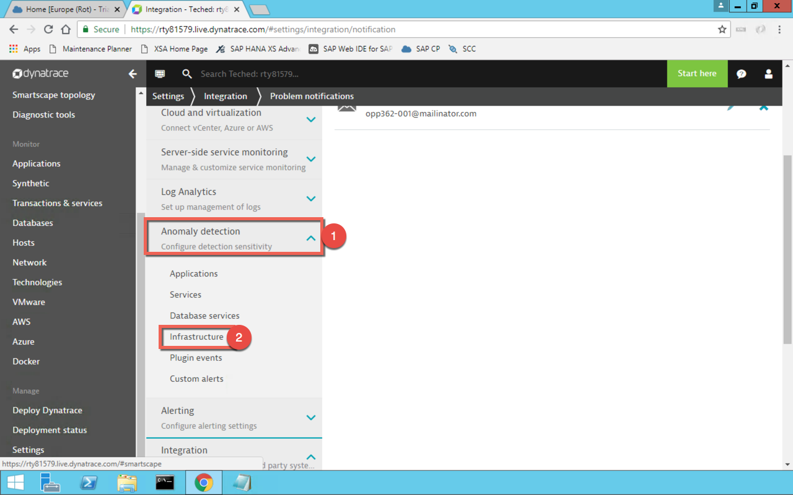  

1. Go to **Detect CPU saturation host** and select **based on custom settings** in the dropdown list.  
    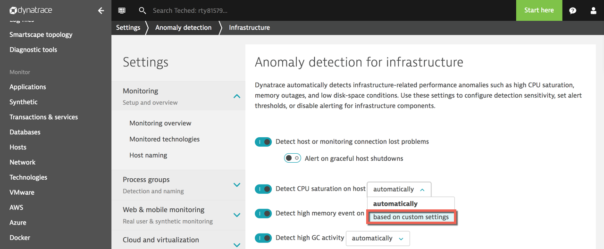  

1. Change the standard threshold from 95% to 80%.  
    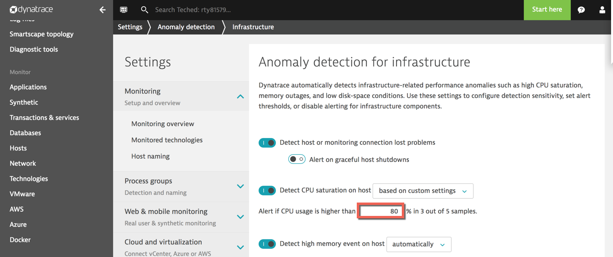  

## 3. Services alerts
1. Dynatrace compares out-of-the box the current behavior of services to a reference period up to 7 days and send alerts if something differs from the baseline. As we don't have such data now, let us configure the detection sensitivity and the alert thresholds. Under **Anomaly detection** click **Services**.  
    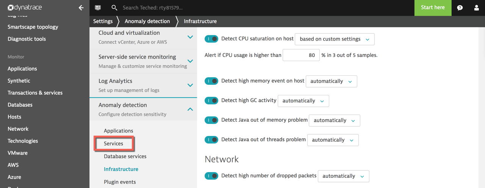  

1. Go to **Detect response time degradations** and select **using fixed thresholds** in the dropdown list.  
    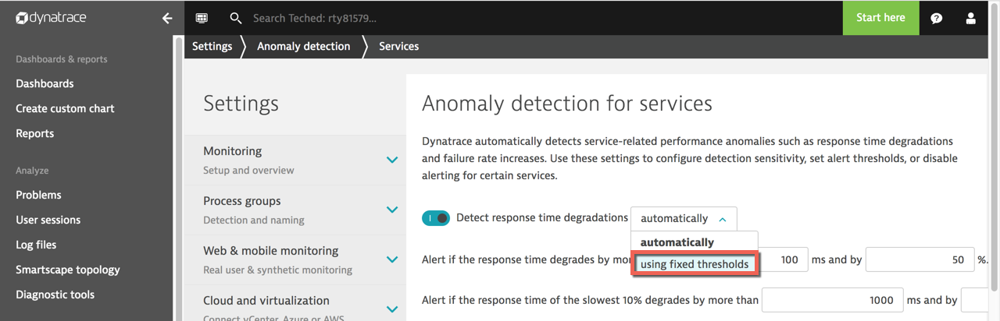  

1. Add the failure --> using fixed + 0%

1. In the over-alerting settings, change the value from **10** to **1** and set the sensitivity to **High**.  
   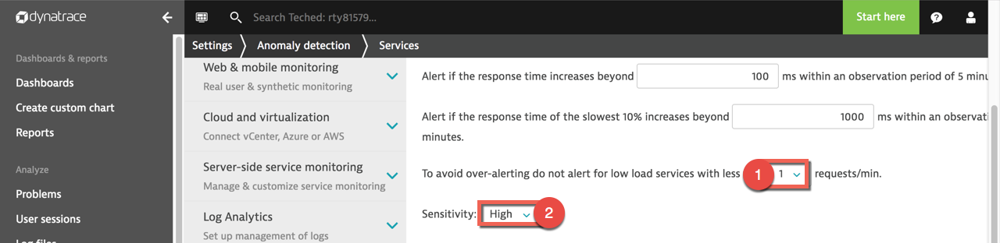  

1. Go to **Detect increases in failure rate** and select **using fixed thresholds** in the dropdown list.  
  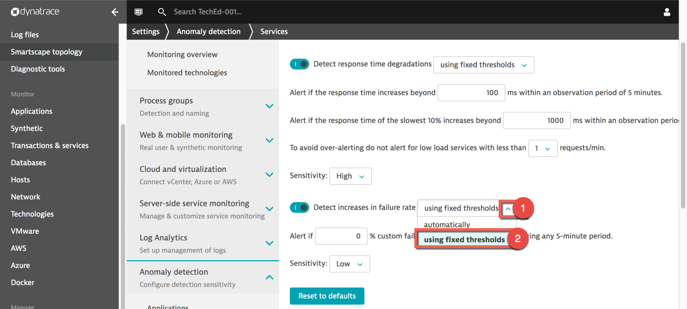

   

 [Previous exercise](../C2/README.md) ｜ [Next exercise](../C4/README.md) ｜ [Overview page](../../README.md)
