# Lesson C: Application performance using Dynatrace
# Exercise C4: Root-cause analysis

#### Objective
In this exercise, you will learn how to navigate through your Dynatrace environment in order to understand the root-cause of different application performance anomalies.<br /><br />

#### Estimated time
10 minutes
<br />
<br />

## 1. Debugging session
1. Copy the file **script-request-load.exe** from the student share folder and paste it to the desktop.<br /><br />
  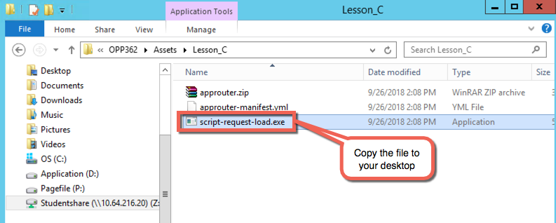<br /><br />

1. Open the terminal by clicking on the icon in the Windows menu.<br /><br />
  <br /><br />

1. Navigate to the desktop with `cd Desktop`.

1. Insert `set HTTP_PROXY=proxy:8080` to add a proxy.
<br /><br />
  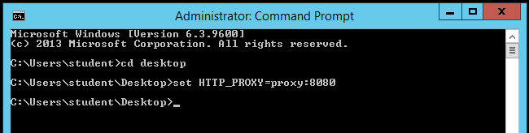<br /><br />

1. We will now launch a script to overload the cloud HANA database with 400 requests. Insert your <P-SUBACCOUNT-NAME> (e.g. p2000499901trial) in the following command and insert/launch it in the terminal. Then wait until you get **Code 200**.<br/>

    ```
    script-request-load.exe "https://espmcloudweb<YOUR-SUBACCOUNT-NAME>.hanatrial.ondemand.com/espm-cloud-web/espm.svc/Products?$skip=0&$top=20&$orderby=Name%20asc&$inlinecount=allpages" 400
    ```

    > Note: you may use Notepad to replace your <P-USER> in the URL.
    <br />

1. Open Dynatrace and navigate to **Problems**. Then wait a second (or a minute ;) until a problem has been recognized and click on the new red tile.<br /><br />
  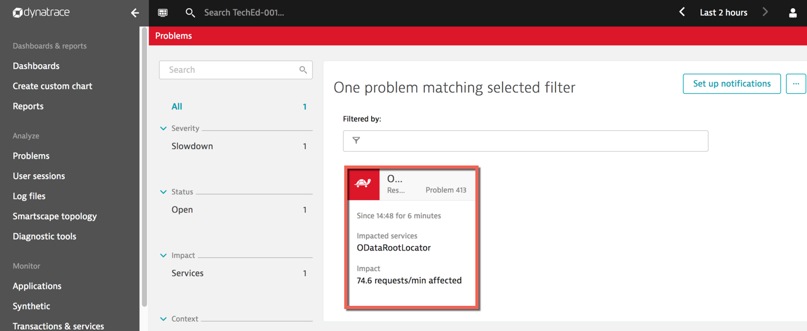<br /><br />

1. Click on **ODataRootLocator**.<br /><br />
  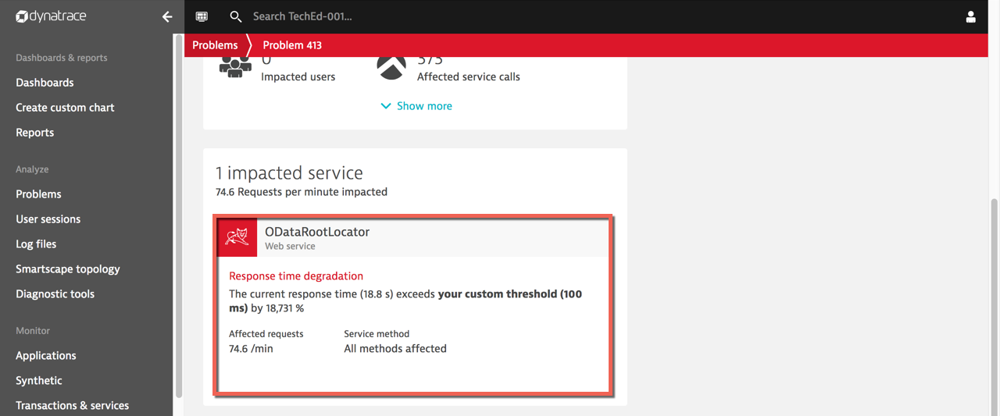<br /><br />

1. Click on **Response Time**.<br /><br />
  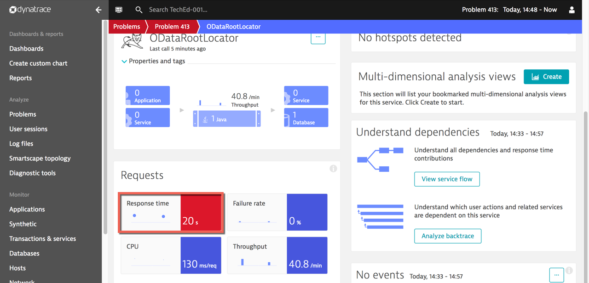<br /><br />

1. Click on **Analyse response time degradation** to see more details about the problem.<br /><br />
  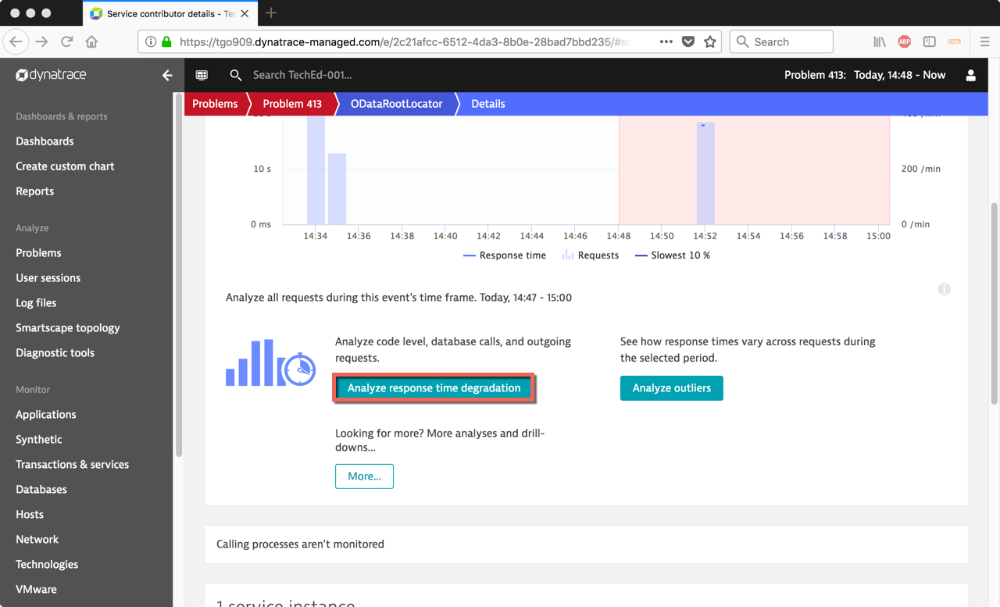<br /><br />

1. Here we can clearly see that the problem is coming from the database. Click on **Connection Acquisition in sap** to see more details.<br /><br />
    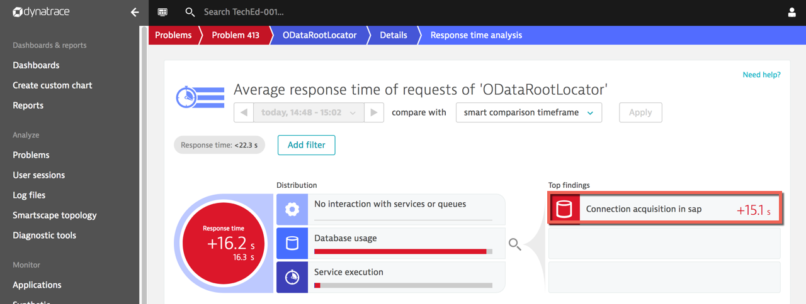<br /><br />

1. The Dynatrace offers an overview with all details needed to better understand and solve the problem.<br /><br />
  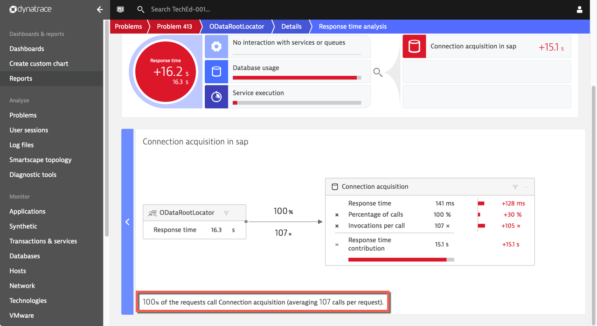<br /><br />


## 2. Debugging session
1. This time we want to simulate an issue on the on-premise backend side. Double-click the icon Stop Cloud Connector.<br /><br />
    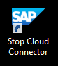<br /><br />
    > Note: As the machine where the Cloud Connector is installed has no agent installed, Dynatrace will analyse the problem as coming from the backend system. To have a better root-cause analysis of the issue, an option would be to download the Dynatrace agent and install it on the host of the Cloud Connector.
    <br />

1. Open the Neo application (Webshop) and click on a product to trigger an error. Then refresh the page a couple of time to simulate some load on the page.<br /><br />
  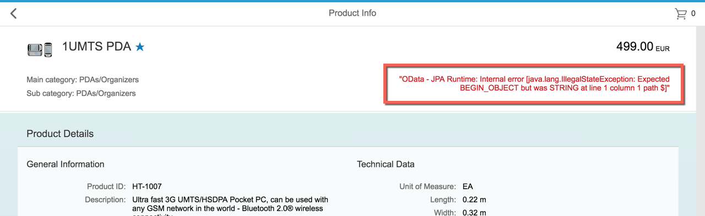<br /><br />

1. Open Dynatrace and go to **Problems**. First we need to reset the time filter, that is still active from the first debugging session. Click on the time settings on the top right corner and select **Last 1 hour** in the tab **Preset** to display the new problem.<br /><br />
  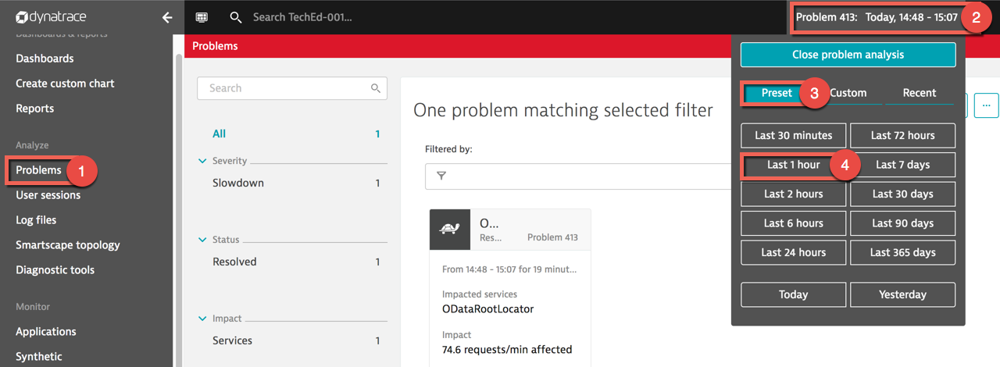<br /><br />

1. Wait a couple of minute until the new problem is visible and click on it<br /><br />
    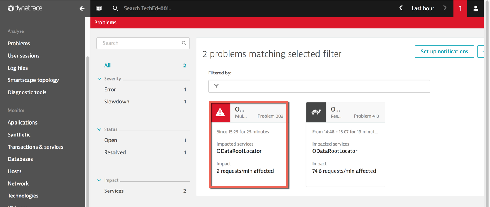<br /><br />

1. Click on the impacted service.<br /><br />
  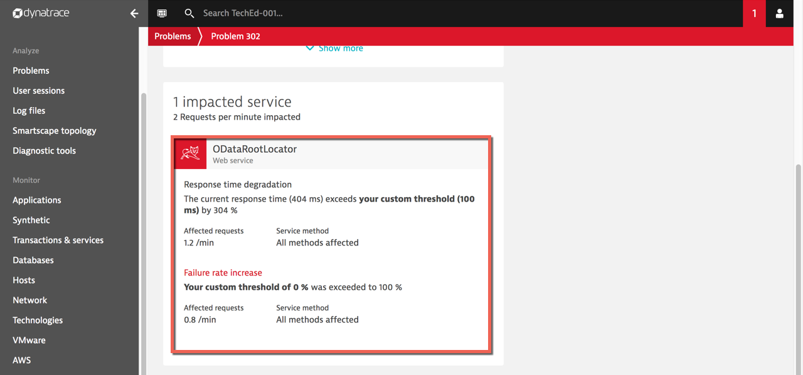<br /><br />

1. Under the section **Requests** click the red-colored tile **Failure rate**.<br /><br />
  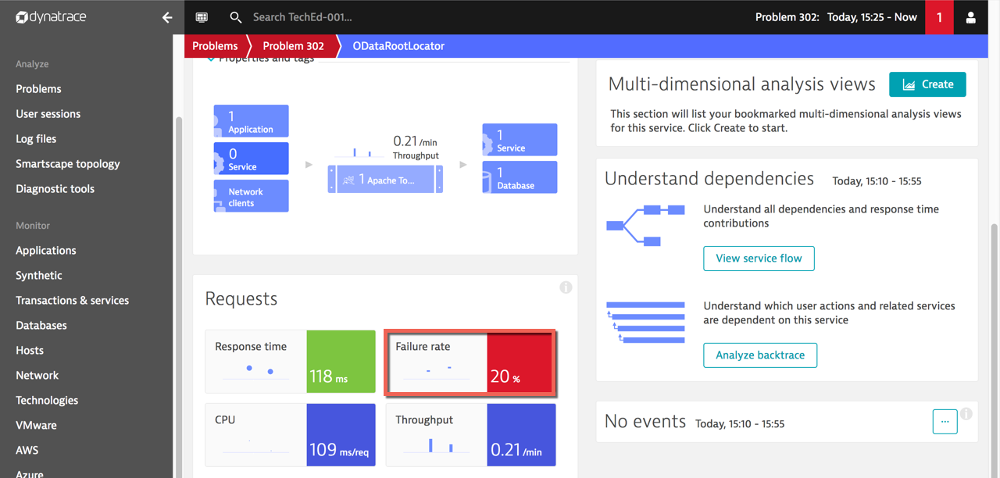<br /><br />

1. Click on **Analyse response time degradation** to understand which requests fail.<br /><br />
  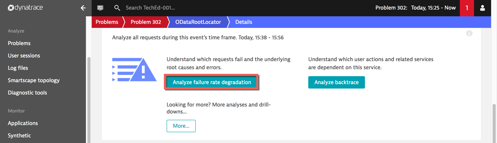<br /><br />

1. Click on **Show potential root causes** to display the underlying root causes.<br /><br />
  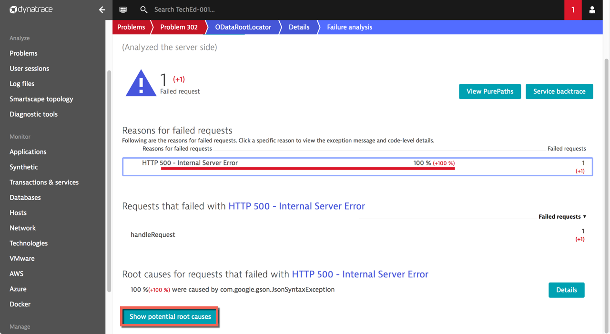<br /><br />

1. Press the button**Details** to display the specific request causing the issue.<br /><br />
  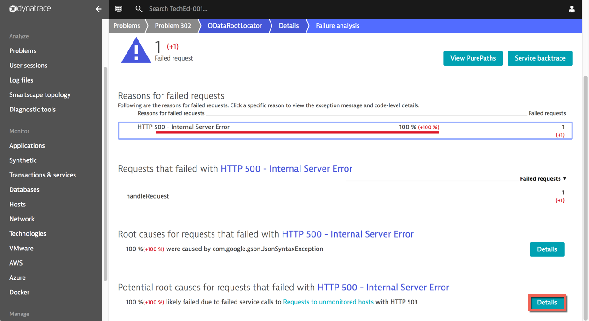<br /><br />

1. We see then the request sent to the Cloud Connector is the problem.<br /><br />
  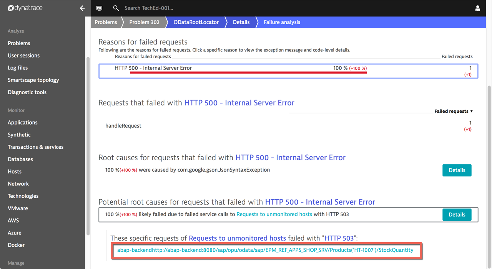<br /><br />

  <br /><br /><br />


[ Previous exercise](../C3/README.md) ｜ [ Overview page](../../README.md)
