# Preparation

#### Objective
To finalize the setup for the exercises, a couple of mandatory steps are needed. You will first access the SAP Cloud Platform cockpit and restart the cloud HANA database. Then you will connect the Cloud Connector to your SAP Cloud Platform subaccount and add an access control to access your backend system. Finally you will verify that the cloud application runs without any issue.

#### Estimated time
10 minutes
 
 

## 1. Restart the cloud HANA database
1. In your web browser open the URL https://account.hanatrial.ondemand.com/ and press the **Log On** button to log into your SAP Cloud Platform trial subaccount.
    > Note: Do not accept the certificate (see step 2), otherwise you will need to open Chrome in incognito mode ;)

      
    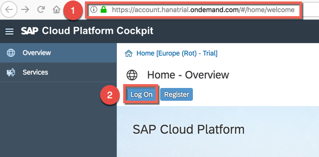  

1. Click **Cancel** in the next popup as we will not use any certificate to login.  
    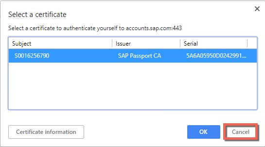  

1. Login with the credentials provided on your Student Overview Paper:
 * User Name: `OPP362-<STUDENT-NUMBER>` (e.g. **OPP362-001**)
 * Password: `Welcome18`   
    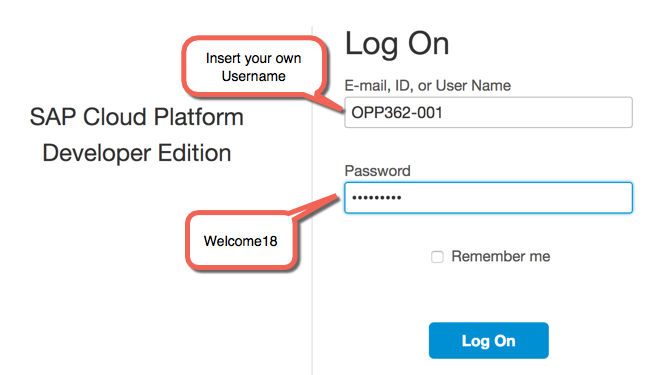  

1. Click the Neo Trial tile to enter your personal developer subaccount in the Neo environment.  
    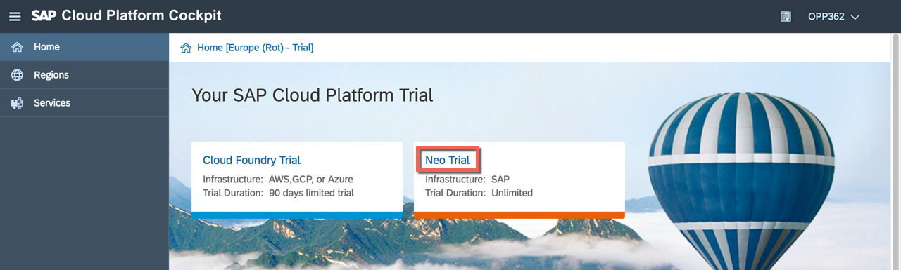  

1. For the sake of time, we have already created a cloud HANA database in your dedicated trial subaccount. You just need to restart it as the database is automatically stopped after 8 hours on the trial landscape. Navigate to **SAP HANA/SAP ASE** > **Databases & Schemas** and click on the database called **espm**.  
    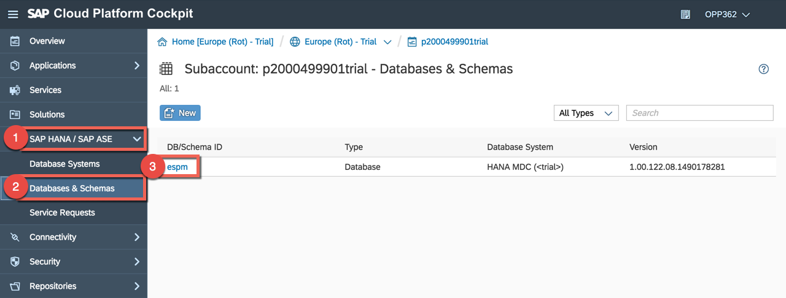  

1. Press the button **Start**.  
    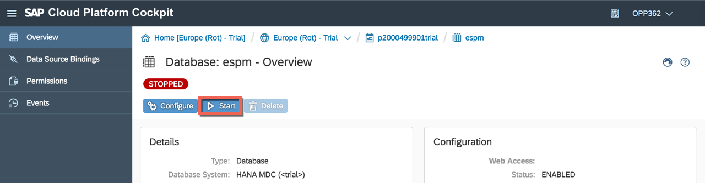
>Note: the start of the database will take a couple of minutes so continue directly with step 2.

  

## 2. Connect the Cloud Connector to your SAP Cloud Platform subaccount
1. The hybrid application is using SAP Cloud Platform Connectivity and the Cloud Connector to consume an on-premise odata service. The Cloud connector has been already installed on your local machine but you need to bind it to your SAP Cloud Platform subaccount. Open the browser Google Chrome and go to [https://localhost8443](https://localhost:8443). As we don't have the UI certificate installed, you will need to click on **Advanced** and **Proceed to localhost (unsafe)**.  
    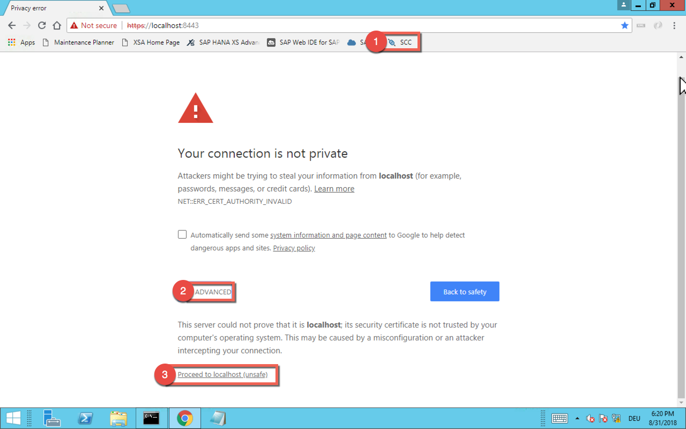  

1. Login to the Cloud Connector with the following credentials:
    * User Name: `Administrator`
    * Password: `welcome`  
      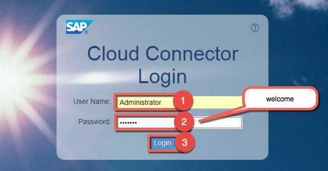  

1. Click on the button **Add Subaccount** and insert the following details in the popup window. Then click **Save**.
    * Region: `Europe(Rot) - Trial`
    * Subaccount: `<YOUR-SUBACCOUNT-NAME>` (e.g. **p2000499901trial**)
    * Display Name: `SCC-OPP362`
    * Subaccount User: `<YOUR-P-USER>` (e.g. p2000499901)
    * Password: `Welcome18`  
      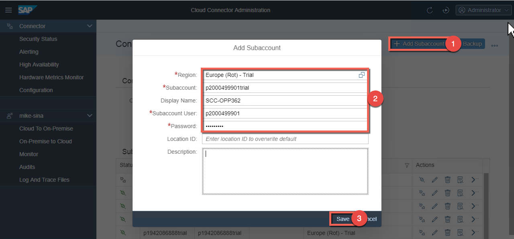  

1. Now we need to import a so called Access Control to define which system and resources will be available on the cloud side. Click on **Cloud To On-Premise** and verify that you have selected the right subaccount (e.g. **SCC-OPP362**). then click the import icon.  
  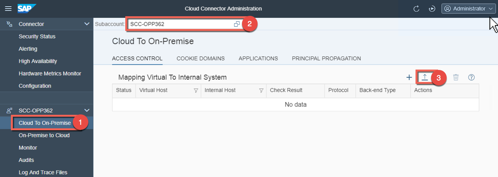  

1. Press the button **Browse** and select the file **Access-Control.zip** from the student share (shortcut can be found on the desktop). Then click **Import**.  
  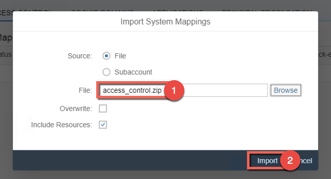  

1. That's all, the Cloud Connector is now configured.  
  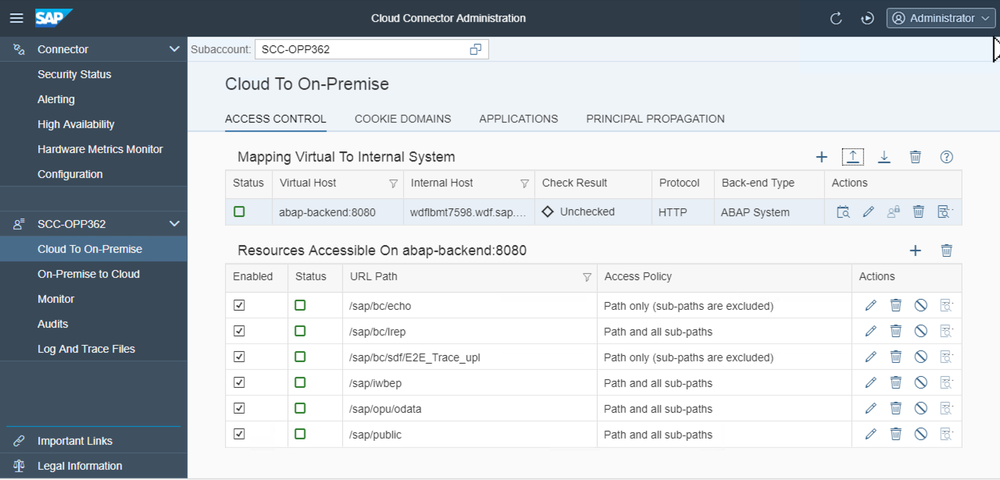  

  You can also verify in your the SAP Cloud Platform cockpit that the system is accessible. Navigate back to the subaccount level and go to **Connectivity** > **Cloud Connectors** and verify that you see the backend system **abap-backend:8080**.  
    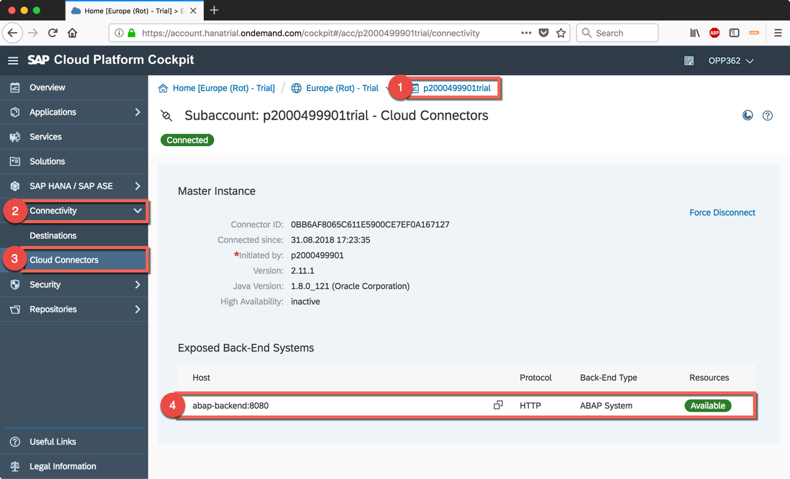

  

## 3. Check the application
1. Let check now that the setup was successful by starting the cloud application. Navigate to **Applications** > **Java Applications** and click on the application named **espmcloudweb**.  

  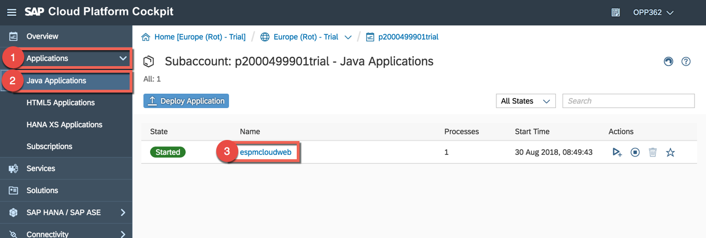

1. Click on the application URL to open it in the browser.  
    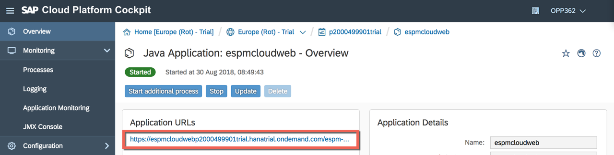

1. Select a product and verify that the product details are displayed as below.  
          
    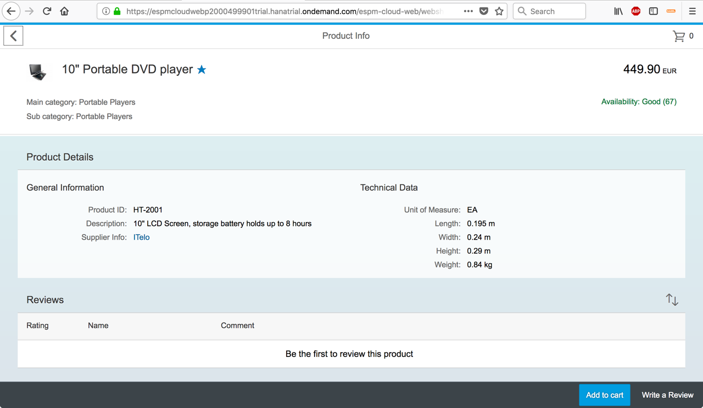

  
  

[ Overview page](../README.md) ｜ [ Start exercise A1](../exercises/A1/README.md)
